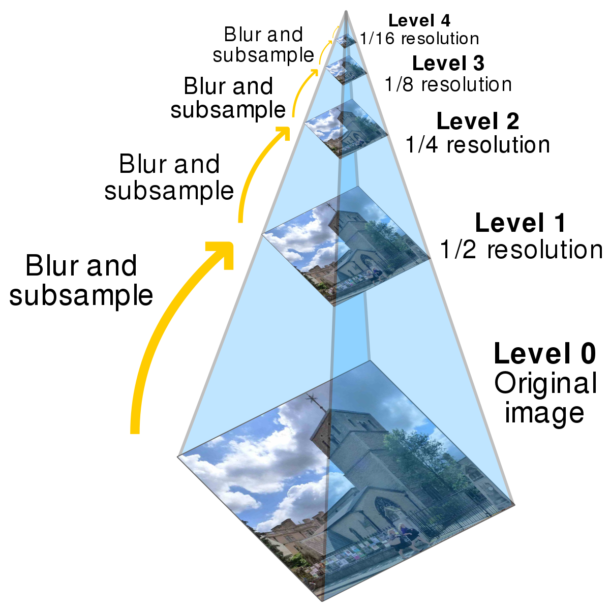
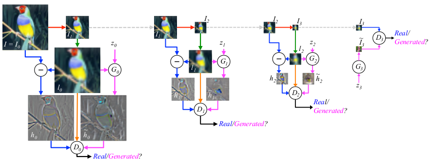
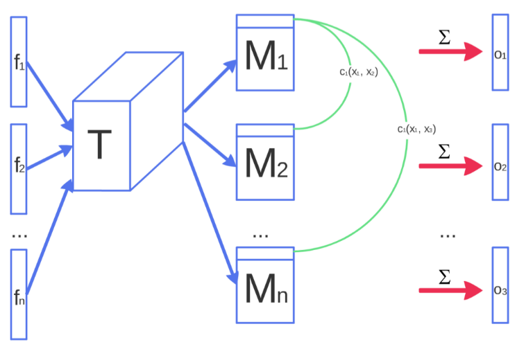

# 20171106-20171126 论文笔记

PS: 文中偶尔出现的 `[...]` 用于帮助读者断句, 此后不再赘述.

> 根据文章的描述, GAN 与 cGAN 的代码实现见[GANs-in-PyTorch](https://github.com/Engine-Treasure/GANs-in-PyTorch)

## TL;DR

LAPGAN 的创新点是: `使用拉普拉斯金字塔的结构, 以从粗糙到细致的方式生成图片. 在金字塔的每一层, 使用 GAN 方法训练一个图片生成模型`

换言之, 该方法利用了自然图片不同尺寸的缩放结构, 构建了一系列的生成模型, 拉普拉斯金字塔的每一层都能够步骤特定尺寸的图像结构.

DCGAN 的贡献是:

1. 复用了训练好的[G 和 D]的部分结构作为特征提取器, 用于监督任务;
2. 提出了一些训练 GAN 的有效方法, 最主要的是: 全部使用卷积层, 不再需要池化; 移除了神经网络最后的全连接层; 使用 Batch Normalization
3. 本文还展示了 G 具有有趣的向量算数运算 (z 空间), 能控制生成的样本的一些语义特征. 比如"带眼镜的男人" - "男人" + "女人" = "带眼镜的女人"

Improved Techniques for Training GANs 文章提出了几项重要方法包括:

1. `feature matching`
2. `minibatch features`
3. `virtual batch normalization`
4. `historical average`
5. `one-sided smoothing`

## LAPGAN

论文地址: [https://arxiv.org/pdf/1506.05751.pdf](https://arxiv.org/pdf/1506.05751.pdf)

> 还是想记录一下相关工作, 对于读者也许也能有所启发.

### 相关工作

DRAW 模型使用了带 RNN + 注意力机制的方式, 通过图片块的轨迹来生成图片.

Sohl-Dickstein et al 2016 使用 diffusion-based 深度无监督学习方法.

Theis 与 Bethge 利用 LSTMs 来捕捉空间依赖, 展示了令人信服的自然纹理修补结果.

---

LAPGAN 模型在拉普拉斯金字塔框架中集成了条件 GAN, 即上篇的 cGAN.

拉普拉斯金字塔是一个线性可逆比的图片表示, 由一组`带通图片`组成, 间隔一个八度 [直译, 不用在意], 加上一个低频残差.

拉普拉斯金字塔的处理过程从最粗糙的层次开始, 可以理解为分辨率最低的图片, 或者说残差. 对其进行上采样, 简单地说就是放大图片, 从 $j \times j$ 提升为 $2j \times 2j$, 显然这时候图片会变得模糊, 求用图片集中 $2j \times 2j$ 的图片与上采样得到的图片的差异, 记作 $h_k$ . 再对真实的 $2j \times 2j$ 的图片重复以上步骤, 直到原始图片, 比如说 $64 \times \ 64$分辨率的图片.

LAPGAN 就有一组生成卷积模型组成, 每一层的目的就是捕捉上述 $h_k$ 的分布. LAPGAN 的`采样`过程如下图所示.

前一篇提到 cGAN 的条件可以是任意信息, 并不止于类标签. LAPGAN 正是利用了这一点. 如上图所示, G 条件于`残差`, 或者说模糊图像; 生成残差与"真实图像"的差异图像 $h_k$; 再将差异与残差组合成"真实图像". 上采样得到更高分辨率的残差, 重复以上步骤. 就得到了最终的全分辨率的生成图像.

D 同样条件于残差, 因为 D 与 G 的条件一致. LAPGAN 的训练过程如下所示. 此时从全分辨率的原始图片 $I_0$ 开始, 对其进行降采样得到 $I_1$, 再对 $I_1$ 进行上采样得到我们所说的残差 $l_0$, 作为 $D_0$ 与 $G_0$ 的条件; $G_0$ 条件于残差 $l_0$, 对 $z_0$ 进行加工, 生成差异图像 $\hat{h_0}$, 作为 $D_0$ 的假样本; 另外由 $I_0$, $l_0$ 得到真实差异图像 $h_0, 完成第一层的训练. 对 $I_1$ 进行同样的处理, 直到最终层.

所以归根结底, $G_0$ 生成的是图像与小一号的图像上采样的结果的差异图像. 从图中看来, 就是图像的细节. 据我所知, 许多生成方法都存在生成图片模糊的问题.

LAPGAN 的关键点就在于, 将生成过程拆分成依次的改进过程. 独立地训练每一层的优点是: 模型更不容易记住训练样本.

## DCGAN

论文地址: [https://arxiv.org/pdf/1511.06434.pdf](https://arxiv.org/pdf/1511.06434.pdf)

### 相关工作

#### 无标签数据的表示学习

在图片上下文, 可以对`图像块 image patches`进行分层聚类, 可以习得有用的图片表示. (Coates & Ng 2012)

另一个计算机视觉研究领域的无监督特征学习的方法是: 自动编码器, 将图片编码成`紧凑代码 compact code`再尽可能精确地解码重构图片. (具体地是: 使用卷积, 将神经网络层堆叠成阶梯结构, 使它能将代码中的*是什么*和*在哪里*组件分离)

深度信念网络对于学习分层表示也有良好的表现.

#### 生成自然图片

GAN 生成的图片有噪声, 难以理解的. LAPGAN 能生成更高品质的图片, 但图片看起来仍然是抖动的, 因为在将多个模型串起来的时候引入了噪声.

#### CNN 的内部可视化

在 CNN 的上下文, Zeiler 等人使用`反卷积 deconvolutional` 和最大过滤, 发现每个卷积过滤器的近似目的; Mordvintsev 等人使用梯度下降检查了能够激活特定过滤器子集的理想图片.

---

### DCGAN 架构与训练方法

DCGAN 的要点:

1. 使用全卷积网络代替判别性的空间池化函数, 以让网络自我学习空间降采样.
2. 移除了卷积特征之后的全连接层. (事实上, G 的第一层还是全连接的, 但它只用于矩阵乘法, 结果立即被变形了; D 的最后一个卷积层也被展开, 最后输出一个 Sigmoid 输出). (作者们还发现`全局平均池化`增加了模型稳定性, 但使收敛更慢了)
3. 使用 Batch Normalization 稳定学习. (BN 的效果很好, 有了它, 不必为初始化带来的问题而纠结, 也能帮助训练更深的模型.) 直接使用 BN 会导致样本抖动, 使模型不稳定. 因此在 G 的输出层和 D 的输入层不适用 BN.

在 G 中使用 ReLU, 唯一的例外是其输出层使用 Tanh; 在 D 中使用 LeakyReLU. (作者们发现, 使用有界的激活函数能使模型更快饱和, 快速覆盖训练分布的色彩空间.)

---

### 实验与讨论与其他

最近的研究表明, 模型学习的快慢与泛化性能有直接联系 (Hardt et al. 2015)

本文使用的评估无监督表示学习算法好坏的方法是: 将习得的算法 (可以理解为 D) 用于监督学习作为特征提取器, 然后评估在此之上的线性模型的性能. 本文提出的具体做法是: 训练好 GAN 模型之后, 在 D 的所有卷积层之后加上最大池化层, 结果得到 4 x 4 的空间网格; 所有这些特征再被展开, 连接成一个向量, 作为一个线性分类器 (文中是 L2-SVM) 的训练输入.

文中指出, CNN 架构不是 DCGAN 成功的关键点.

本文表示, 在大型图片数据集上训练的无监督 DCGAN 能习得特征的分层表示. 文中展示了 D 会被卧室的典型部分所激活, 比如床或窗户.

另外很有意思的是, 如前所述, 本文展示了图片向量也能进行算术运算. 这个运算实际是对 Z 向量的操作, 这也表明对潜变量的修改, 能改变生成样本的语义.

作者们发现, 从 G 与 D 的 BN 中移除 scale 与 bias 参数能产生更好的结果. 他们猜测, 这可能是因为 BN 引入的噪声能帮助 G 更好地探索低层的数据分布, 从而更好地生成样本.

---

## Improved Techniques for Training GANs

---

训练 GAN 需要找到具有连续的, 高维参数的非凸博弈的纳什均衡. 训练 GAN 的典型方法是使用梯度下降, 但梯度下降是用于找到成本函数的极小值, 而不是博弈的纳什均衡, 因此使用梯度下降算法无法使结果收敛.

### Feature matching

特征匹配通过为 G 指定一个新的观测值, 防止了在当前 D 上的过度训练, 从而解决了 GAN 的不稳定性. 这个新的观测值要求 G 生成匹配真实数据的统计量的数据, 而不是直接最大化 D 的输出, 而我们使用 D 来指定值得匹配的统计量.

特别地, 我们训练 G 来匹配 D 的中间层的特征的期望值. 因为训练 D 的目的就是找到最能区分真实样本与生成样本的特征, 因此这种做法是很自然的.

用 $f(x)$ 来表示 D 中间层的激活值, 那么 G 的新观测值就可以表示为 $||\mathbb{E}_{x~p_{data}} f(x) - \mathbb{E}_{z~p_{z}(z)} f(G(z))||_2^2$

常规的 GAN 训练, G 的目标是去匹配训练数据的分布, 是一个定点. 实际中无法保证达到该点. 但经验显示特征匹配在常规 GAN 不稳定的情况下是有效的.

### Minibatch discrimination

GAN 的主要缺点之一是容易发生 `模式崩塌 mode collapse`. 当接近模式崩塌时, 对于许多相似的点, D 的梯度将朝向相似的方向. 由于 D 总是独立地处理样本, 它的梯度之间没有协调机制, 无法让 G 去生成互不相同的样本.相反, G 所有的输出都趋向于同一点, 这使得 D 相信这个点是高度真实的. 于是就发生了模式崩塌. 这之后, G 只生成一个样本, 梯度下降无法分离各输出. 于是, D 的梯度将永远推着 G 生成的单个样本在空间中移动, 算法永不收敛.

Minibatch discrimination 的概念是这样的: 任何 D 组合地查看多个样本, 而不是以分离的方式, 这就避免了 G 的模式崩塌.

具体实现是这样的: 用 $f(x_i) \belong \mathbb{R}^A$ 表示输入 $x_i$, D 的中间层的特征向量, 乘以一个张量 $T \belong \mathbb{R}^{A\timesB\timesC}$, 得到一个矩阵 $M_i \belong \mathbb{R}^{B\timesC}$. 然后对各输入 $X_i$ ($i \belong {1, 2, ..., n}$) 计算得到的 $M_i$ 计算对应行的 L1 距离, 再对结果应用负指数运算, 即 $c_b(x_i, x_j)=exp(-||M_{i, b} - M_{j, b}||_{L_1})$ (其中 b 表示对应的行). 再之后, 对 $x_i$ 与其他所有样本计算得到的所有的 $c$ 求和, 记作 $o(x_i)$, 用 $o(X)$ 表示 $o(x_i)$ 的矩阵. 将 $o(X)$ 与 $f(X)$ 串起来作为下一层的输入.

使用 Minibatch discrimination, D 除了判别真实与生成样本, 现在还可以利用样本与同一批里其他样本的不同作为额外信息.

本文展示了, minibatch discrimination 能快速生成视觉上更真实的样本, 效果甚至超过特征匹配. 特征匹配则在半监督学习中训练一个强分类器更有帮助.

### Historical avearing

`Historical avearing 历史平均` 的概念很直观, 就是在 G 和 D 的成本函数中加入 $||\theta - \frac{1}{t} \Sigma_{i=1}^{t}\theta[i]||^2$ 这一项, 其中 $\theta[i]$$ 就是过去时间 i 对应的参数值.

参数的历史平均可以通过在线学习的方式更新, 因此这种学习方式在长时间序列上也能很好地缩放.

### One-sided label smoothing

`Label smoothing 单边标签平滑`的概念很简单, 就是用 0.9 和 0.1 来代替原来是 1 和 0 的标签. (0.9 和 0.1 只是举例, 也可以使用 0.8~1.1 的随机数替换标签 1).

本文指出, 使用双边标签平滑, 则最优 D 表示为 $D(x)=\frac{\alpha p_{data}(x) + \beta p_{model}(x)}{p_{data}(x) + p_{model}(x)}$. $p_{model}(x)$ 出现在分子中是有问题的, 因为当 $p_{data}$ 接近 0, 而 $p_{model}(x)$ 很大时, 来自 $p_{model}(x)$ 的错误样本就不会向更真实的数据改变.

### Virtual Batch Normlization

Batch Normalization 能极大地提高神经网络的优化效果. 但它也使得一个样本高度依赖于同一批的其他样本.

为解决以上问题, 本文提出了 `Virtual Batch Normalization VBN`, 训练过程中, 基于`reference batch` 的统计量来归一化 x, 而 reference batch 在训练开始时选定并固定不变. reference batch 根据它自身的统计量进行归一化.

使用 VBN 训练时需要在两个 Minibatch 上进行前向传播, 因此计算代价大. 本文只在 G 上使用.

---

### 其他

本文提出了一个评估样本的方法: 将每张生成的图片输入 Google Inception Net, 得到条件标签分布 $p(y|x)$. 如果图中包含有意义的物体, 那么 $p(y|x)$ 应具有一个低熵. 此外, 使用 GAN 都希望生成不同的图片 (样本), 即边缘 $\int p(y|x=G(z))dz$ 应具有高熵. 因此, 结合两者, 得到了评估指标: $exp(\mathbb{E_x} KL(p(y|x)||p(y)))$, 对结果应用指数运算的目的是后续更容易比较. 该评估方法称为`Inception Score`

根据作者的经验, Inception Score 对于大量样本的多样性评估很有帮助.

#### 半监督学习

本文提到一种半监督学习方法, 将 G 生成的样本加入数据集, 作为分类器的正常输入, 标记为第 K+1 类, 相应地将分类器的输出维度从 K 改为 K+1. 然后 $p_{model}(y=K+1|x)$ 就可以作为样本是假的概率, 对应于原始 GAN 框架中的 $1-D(x)$. 这样做的好处是, 只要知道真实的 K 类之一哪个能最大化 $log p_{real}(y \belong {1, ..., K})$, 就可以估计生成的无标签样本所属的类. Amazing!

此时可以对损失函数进行分解, 如下 (为了方便, 直接贴图了):

此时 $L_{unsupervised}$ 实际上就是 GAN 的博弈值. 最小化 $L_{supervised}$ 和 $L_{unsupervised}$ 的最优解具有性质: $exp[l_j(x)]=c(x)p(y=i, x) for all j<K+1$, $exp[l_{K+1}(x)]=c(x)p_G(x)$, 这意味着无监督损失和监督损失是一致的.

该半监督学习的方法引入了 G 与分类器之间的交互. 并且作者们发现使用`特征匹配`来优化 G 的效果特别好, 而 mini-batch discrimination 根本没起效.

最后, 作者们表示 K+1 的分类器是过参数化的, 因为从所有输出对率中减去 $f(x)$ 并不会改变 softmax 的输出. 这意味着可以等效地固定 $l_{K+1}(x)=0 for all x$, 这样 $L_{supervised}$ 就变成了原来 K 类的分类器的标准监督损失函数, 那么 D 可以表示为 $D(x)=\frac{Z(x)}{Z(x)+1}$, $Z(x)$=\Sigma_{k=1}^{K}exp[l_k(x)]$

---

本文强调了图片标签对于图片品质的重要性. 原因是本文提出的 `Inception Score` 与人工评估间存在高度相关性. 他们将这归因为人类的视觉系统对于能帮助推理物体类别的图片统计量更适应, 而对于无益于图片解释的局部统计量更不敏感.
