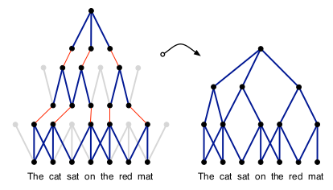

# 20171218-2017124 论文笔记

> 一位读者觉得往期文章的翻译色彩太浓, 一些术语翻译成中文反而反应不过来. 因此本文尝试在术语第一次出现时使用双语, 以后使用原英文表示.

## TextRank: Bringing Order into Texts

论文地址: [https://web.eecs.umich.edu/~mihalcea/papers/mihalcea.emnlp04.pdf](https://web.eecs.umich.edu/~mihalcea/papers/mihalcea.emnlp04.pdf)

本文提出了一个`基于图的文本处理的排名模型, graph-based rank model for text processing`.

所谓`基于图的排名算法, graph-based ranking algorithm`, 就是通过考虑整张`图, Graph, G[简]`的全局信息, 而非特定`顶点, Vertex, V[简]`的局部信息来决定图中顶点的的重要性的方法.

Graph-based ranking model 实现的基本思想是`投票, Vote`或`推荐, Recommendation`. 当一个顶点连接到另一个顶点时, 记作为另一个顶点投了一票. 得票数越多, 顶点越重要. 反过来, 顶点越重要, 它投出的票也越重要. 简而言之, 一个顶点的重要性, 取决于它的票数, 以及投票的顶点的重要性. \(这是一个鸡生蛋, 蛋生鸡的正反馈循环,\)

文章采用 PageRank 论文提出的方法来计算顶点的得分, 如下:

[unweighted\_vertex\_score.png](https://github.com/iamkissg/PaperHighlights/tree/e748838bc232093f9685c22210ec5bff856cf116/2017/12/unweighted_vertex_score.png)

其中 In\(Vi\) 表示指向 Vi 的顶点集, Out\(Vi\) 表示 Vi 指向的顶点集 \(`有向图, directed graph`\). d 是`阻尼因子, damping factor`, 表征了从一个顶点跳到另一个顶点的概率. 文中此处应该援引了 PageRank 论文: In the context of Web surfing, 用户随机点击链接的概率是 d, 跳转到新页面的概率是 1-d. d 通常设为 0.85

graph-based ranking algorithm 算法执行完毕后, 顶点的得分就表示它在图中的重要性. 而算法收敛\(执行完毕\)的依据是图中任意顶点的`错误率, error rate`低于某一给定`阈值 threshold`. 由于顶点的真实得分不可知, 文中用  来近似表示 error rate.

当将`基于图的循环排名算法, recursive graph-based ranking algorithm`应用于`无向图, undirected graph`时, 顶点的出度等于入度, `边, Edge`数与顶点数成比例, 使得无向图的收敛曲线更平缓.

将 graph-based ranking algorithm 应用于`赋权图, weighted graph`时, 顶点的得分计算公式改写如下:

以文本作为图, 执行 graph-based ranking algorithm, 就得到了 TextRank 算法, 其一般执行过程如下:

1. 确定`文本单元, text unit`\(能用于表示文本的字词, 或短语等\), 作为顶点——Identify text units that best define the task at hand, and add them as vertices in the graph;
2. 确定 text unit 之间的关系, 以之作为图的边——Identify relations that connect such text units, and use these relations to draw edges between vertices in the graph. Edges can be directed or undirected, weighted or unweighted;
3. 执行算法——Iterate the graph-based ranking algorithm until convergence;
4. 根据重要性排序——Sort vertices based on their final socre. Use the values attached to each vertex for ranking/selection decisions.

文中用了 2 个实际例子来证明 TextRank 的有效性.

1. `关键词提取, keyword extraction`. 从文本中自动提取关键词 \(想象一下自动提取论文关键词\)\(后面的一篇文章就使用了该方法\).
   * 此时, 使用了`co-occurance`来确定词的关系: 有一个大小为 N 的窗口, 当两个词同时落在这个窗口中时, 就判断它们是有联系的, 在它们的顶点之间加一条边.
   * 选择顶点时, 用 `语法过滤器, syntactic filter`过滤掉无意义的词, 此外, 文中仅使用单个单词作为顶点, 所有的词组短语都被打散了. \(维护一张很大的图是一种开销\).
   * 顶点的初始得分可以随意设置, 简单点就设为 1; 可以设置最大迭代次数, 比如 20 次; 算法收敛的 threshold 根据顶点数与初始值而定, 比如 0,0001; 最终从文本中提取多少个关键词, 视文本而定, 较短的文本可考虑较少的关键词;
   * 文中还提到了一种`后置处理 post processing`方法: 提取的关键词在文本中是相邻出现的, 那么合并成一个词组.
   * 实验结论:
     1. 窗口越大, 精确度越低, 因此窗口不宜过大
     2. 当过滤器过滤仅剩下名词与形容词时, 效果最好. `语言信息, linguistic information`能帮助提取关键词
2. `关键句提取, sentence extraction`. 从文本中自动提取出总结性的句子.
   * `co-occurance`不再适用于 sentence extraction. 文中定义了另一种`相似性关系, similarity relation`, similarity 定义为两个句子内容的重叠度.
   * 文中将这种关系描述为一个`推荐, recommendation`过程: 一个句子表达了某一理念, 它会向读者推荐另一个表达了相同理念的句子.
   * 本文采用如下公式来描述句子相似性: 

重要的事情再说一遍: TextRank 有效的一个原因是, 它利用的是整个文档的全局信息, 而不是一个 text unit 的局部上下文.

### Levenshtein distance

我看到 TextRank 的一些开源实现, 采用 Levenshtein distance 来计算两个 keywords 之间的关系. 简单了解了一下.

[In information theory, Linguistics and computer science, the Levenshtein distance is a string metric for measuring the difference between two sequences. Informally, the Levenshtein distance between two words is the minimum number of single-character edits \(insertions, deletions or substitutions\) required to change one word into the other.](https://en.wikipedia.org/wiki/Levenshtein_distance)

计算公式如下:

## A Convolutional Neural Network for Modelling Sentences

如标题所示, 本文提出了一种使用 CNN 对句子进行建模的方法, 称为`Dynamic Convolutional Neural Network, DCNN`, 使用`Dynamic k-Max Pooling`. 以下是一个较直观的示意图.

`Sentence modeling, 以下简称 SM`旨在分析和表示句子的`语义内容, semantic content`. 一个句子由若干个单词\(字\)组成, 因此 SM 基于句子中高频单词或 n-grams 的特征来表示句子.

In some cases, composition is defined by algebraic operations over word meaning vectors to produce sentence meaning vectors.

本文提出的 DCNN, 交替使用`1-D Conv Layer`和`Dynamic k-max pooling layer`.

Dynamic k-max pooling 是一般 max pooling 的泛化, 它返回 k maximum values 的子序列而不是 maximum value, 动态则体现在它能根据输入序列的长度而选择参数 k.

Conv layer apply 1-D filters across each row of features in the sentence matrix \(\[num\_words x embedding\_dim\]\).

具体地, 1-D 卷积是权重向量 **m** 与输入向量 **s** 之间的点积. 此时 **m** 就是卷积的 filter, **s** 作为句子, 其每个元素 s\_i 对应一个单词. 1-D 卷积背后的思想是计算 **m** 与 **s** 的每个 m-gram 的点积, 获得另一个序列 **c**: .

有两种类型的 1-D 卷积: `narrow type`与`wide type`. 如下所示. narrow convolution 要求 len\_s &gt; len\_m, 上述公式中, j 的取值在 len\_m 和 len\_s 之间; 而 wide convolution 对两个向量的长度没有要求, 只是 j 的取值范围更大了, 1 到 len\_s + len\_m - 1 之间 \(需要 zero-padding\). wide convolution 相比 narrow convolution 的优势在于: 确保了 filter 中的所有权值都应用到了整个句子上, 同时保证了总是能生成有效的, 非空的 **C**. \(本文就采用了 wide convolution\)

k-max pooling 操作降采样得到 k 个最大个特征, 保留特征在原始序列中的顺序, 但不关心它们的具体位置.

Dynamic k-max pooling 则将 k 设置成输入序列的长度与网络深度的函数, 文中采用的方式是: . 其中 k\_{top} 是最后一个卷积层的 k.

Dynamic k-max pooling 后接一个 non-linear layer. 为 pooled matrix 的每一行 \(根据框架与编程习惯不同, 你的可能是列\) 分配一个 bias, 然后对其应用一个 non-linear function.

以上的 wide convolution, dynamic k-max pooling 及 non-linear transfer 都是在 sentence matrix **s** 的每一行内进行的. 这使得不同行之间一直相互独立, 直到神经网络顶层. 因此本文最后提出了一个称为 `folding` 的方法, 在 convolutional layer 之后, k-max pooling 之前, 将相邻的每两行相加, 从而减缓了行间的相互依赖问题.

