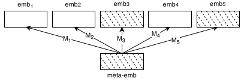

### Learning Word Meta-Embeddings

论文地址: [http://www.aclweb.org/anthology/P16-1128](http://www.aclweb.org/anthology/P16-1128)

##### 要点

本文首次提出了 **Word Meta-Embedding** 的概念 (以下简称 wme): 不同 embeddings 之间存在互补性, 以集成 (ensemble) 的方式同时使用多个 embedddings 很多时候能取得更好的结果, 因为语义更丰富了, vocab 更大了. 文章提出了 3 种集成方法:

1. CONC: 将同一个词的不同 embeddings 拼接, 得到更长的向量, 文中使用了加权拼接, 为更好的预训练 embeddings 设置了更高的权值;
2. SVD: 对 CONC 得到的 Embedding Matrix (简称 EM) 作奇异值分解 , 取 U 的前 d 维作为最终的 EM;
3. 1TON: 以不同 embeddings 为目标, 学习 wme, 看下图就一目了然了. 从 wme 出发, 经线性变换后得到不同预训练的 embeddings.

以上 3 种方法适用于 embeddings 的交集, vocab 并没有变得更大. 为增大 vocab, 文章扩展了 1TON => 1TON+, 示意图如下. OOV, 即不在一些 embeddings 中, 但存在于其他 embeddings 的单词, 也是学习的目标, 它们和 wme 一样初始化/更新. (此处的 OOV 不指不存在于任何预训练 embeddings 中的单词)

最后文章提出了一种 MUTUALLEARNING 方法来学习 OOV embeddings. 类似于 1TON+, 只是现在在交集上学习预训练 embeddings 间的线性变换, 然后对从其他 embeddings 中映射来的向量求平均, 作为 OOV 在当前 embeddings 中的表示.

##### 备注

* 只用 1TON 学习整个 vocab (并集) 应该足矣. 1TON+ 的提出, 更多是为了补全预训练 embeddings, 目的同 MUTUALLEARNING.
* 只有 1TON(+) 体现了 Meta; CONC 和 SVD 只体现了集成的思想.
