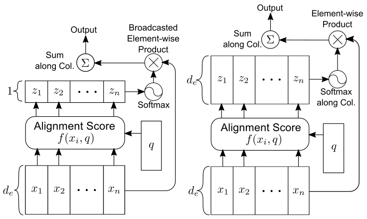
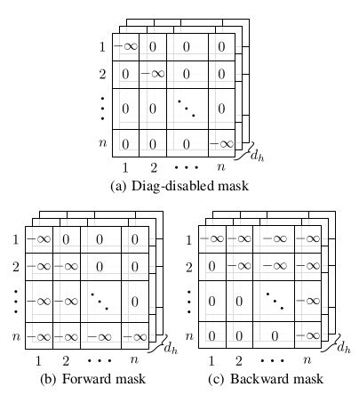
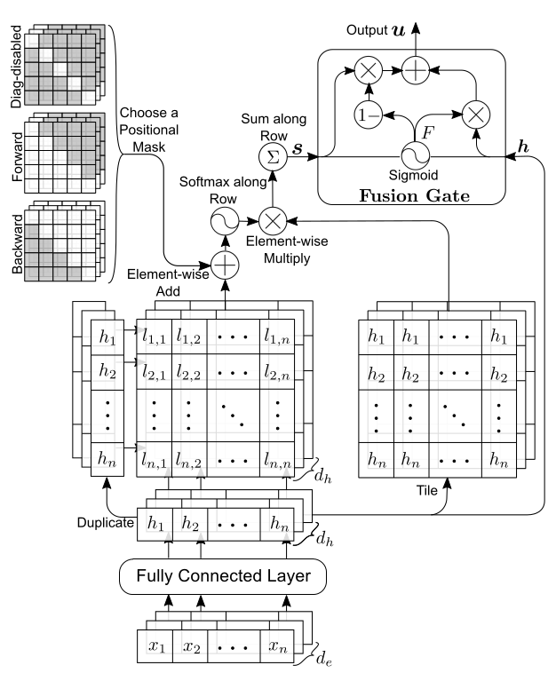
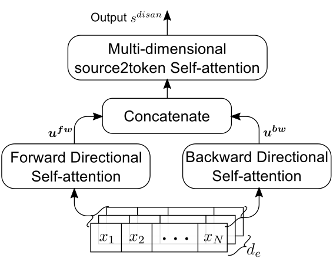

### [DiSAN: Directional Self-Attention Network for RNN/CNN-Free Language Understanding](https://arxiv.org/abs/1709.04696)

**TL;DR** 本文创新性地提出了 2 种 attention mechanism: *multi-dimensional attention* 和 *directional attention*. 前者用矩阵代替向量来表示 attention weights, 将加权求和细化到状态向量的每一维; 后者通过 Mask 矩阵将方向编码进 attention, 解决了时序丢失问题. 基于两种 attention 的 self-attention 版, 提出了 *Directional Self-Attention Network, DiSAN* 模型, 在不依赖 RNN/CNN 的情况下, 在多项任务 NLP 任务上取得了 SOTA 的成绩.

#### Key Points

* self-attention 与普通 attention 的不同之处在于 query. 前者的 query 来自序列本文, 即序列中的某个元素; 后者的 query 来自序列之外.
* 完全依赖 attention 来表示序列, 必须解决序列的时序丢失问题. 本文提出了 directional self-attention 的解决方案. (Transformer 的解决方案是将 Positional Encoding 与 Input Embedding 结合)
* 此外文章还提出了 multi-dimensional (self-)attention, 将 token embedding 的每一位数字看作一个 feature, 将 attention 细化到 feature 层面, 计算 feature-wise attention.

##### Multi-Dimensional (Self-)Attention

* 普通 attention 的 alignment score 是一个标量, 即 $z_i=f(x_i, q)=w^T\sigma(W^{(1)}x_i+W^{(2)}q)$ (文中使用 additive attention, 大写字母表示矩阵), 之后 $p_i=softmax(z_i)$ 得到的 attention weight $p_i$ 也是一个标量, 最后计算输出状态 $s=\Sigma_{k=1}^{n}=p_k x_k$, 向量 $x_k$ 的每一数字 共享同一个 attention weight.
* Multi-dimensional attention 的依据是 $x_k$ 的每一位数字都是一个特征 (比如 king 的词向量, 某一位数字表征性别, 某一位数字表征尊贵程度), 可以拥有自己的 attention weight, 文中称为 feature-wise attention. 具体做法就是将上面 f 函数中的权值向量替换为权值矩阵: $z_i=f(x_i, q)=W^T\sigma(W^{(1)}x_i+W^{(2)}q + b^{(1)}) + b$ (增加了 bias, 不要紧). 如此得到的 $z_i$ 将是与$x_i$ 具有相同 embedding dimension 的向量, 该向量的每一位数字表征 $x_i$ 与 q 相应位置上的对齐程度. 后续的计算过程与上总体无异, 只是 z 成了矩阵, softmax 应用于 z 的第二维.
* (左图维普通 attention, 右图为 Multi-Dimensional Attention)

* Multi-dimensional attention 对于同一个 token embedding 的不同 feature 计算不同的 attention weight, 充分利用了上下文与 token 不同特征之间的对齐程度. 还是以 king 为例, 当上下文强调性别属性时, 性别特征将得到更大的 attention weight, 而尊贵程度不那么重要, 可能就只分配很小的 attention weight. 对于一词多义的情况, multi-dimensional attention 还具有一定的消除歧义作用
* 在 multi-dimensional attention 的基础上, 文章得到了 2 个 self-attention 变种, 两者的差别在于 query:
    * token2token: 计算序列中两个位置的依赖程度 (对于 self-attention, 依赖的说法比对齐更合适), 此时只需将外部 query q 替换为序列中另一个位置的状态即可: $z_i=f(x_i, x_j)=W^T\sigma(W^{(1)}x_i+W^{(2)}x_j + b^{(1)}) + b$. 由于需要计算位置两两之间的对齐程度, token2token 的输出是一个矩阵;
    * source2token: 计算序列某位置状态与整个序列的对齐程度, 文章简单地将 query 剔除了: $z_i=f(x_i)=W^T\sigma(W^{(1)}x_i+ b^{(1)}) + b$. 注意, source2token 的 输出是向量.

##### Directional (Self-)Attention

* Directional self-attention (DiSA) 由一个全连阶层 FC, 一个 masked multi-dimensional token2token self-attention block, 一个 fusion gate 组成:
    * FC 将输入序列转换成隐藏状态的序列;
    * multi-dimensional token2token self-attention 学习各隐藏状态之间的关系, 并使用 Mask 将方向编码进结果;
    * fusion gate 是一个门控单元, 控制 DiSA 中 FC 的输出与 token2token 输出的比例
* 通过 mask 矩阵, 实现了非对称依赖, 即 $h_j$ 对 $h_i$　有依赖, 反之却没有. 从而实现了方向性.
* Mask 是一个非零即负无穷的方阵, 因为 $exp(-\infty)=0$, 从而能抑制依赖关系: $f(h_i, h_j)=c \cdot tanh([W^{(1)}h_i+W^{(2)}h_j + b^{(1)}]/c) + M_{ij}\mathbb{1}$ (此处对 token2token 进行了简化, 减少了参数).
* 文中使用了 forward mask 与 backward mask. 前者的作用是使得只存在后面状态对前面状态的依赖; 后者则恰好相反.

* Fusion gate 是 dimension-wise 的, 即全面控制输出结果向量的每一位数字: $F=sigmoid(W^{(f1)}s + W^{(f2)}h +b^{f})$, $u=F\bigodot h+(1-F)\bigodot s$.

* 最终, DiSAN 由两个 DiSA blocks 和一个 multi-dimensional source2token self-attention layer 组成. 通过 DiSA 分别对前向与反向*上下文依赖 context dependency* 进行建模, 为每一个 token 生成一个*上下文感知 context-aware* 的表示; 然后用 source2token 计算整个序列的向量表示.

* 由于对 DiSA 模块进行了参数简化, DiSAN 相比绝大多数基于 Bi-LSTM 拥有更少的参数, 模型更简单.
* 本文的实验部分证明:
    * feature-wise attention 是有效的, 能带来性能提升;
    * multi-dimensional atention 比 multi-head attention (Transformer 中提出) 有性能提升;
    * 双向 DiSA 比 Bi-LSTM 也有性能提升;
    * Mask 也带来了性能提升;
    * 带时序的方向信息能帮助生成上下文感知的 word representation;
    * 前向与反向 DiSA 关注序列的不同部分;
    * multi-dimensional attention vector 确实捕获了同一个单词相对于不同上下文的不同特征重要性.

#### Notes/Questions

* 在笔者看来, 本文确实是一篇很精彩的论文, 引言写得好, 创新点好, 模型介绍得好, 实验很详尽, 分析很到位, 模范论文.
* 引言对 attention 有一段精炼的描述:

> The attention uses a hidden layer to compute a categorical distribution over elements from the input sequence to reflect their importance weights. It allows RNN/CNN to maintain a variable-length memory, so that elements from the input sequence can be selected by their importance/relevance and merged into the output.

* 实际应用中, additive attention 比 multiplicative (dot) attetion 的预测性能更好, 但后者能利用矩阵乘法, 计算更快, 内存使用更高效. 本文选择了 additive attention, 而 Transformer 选择了 multiplicative attention.
