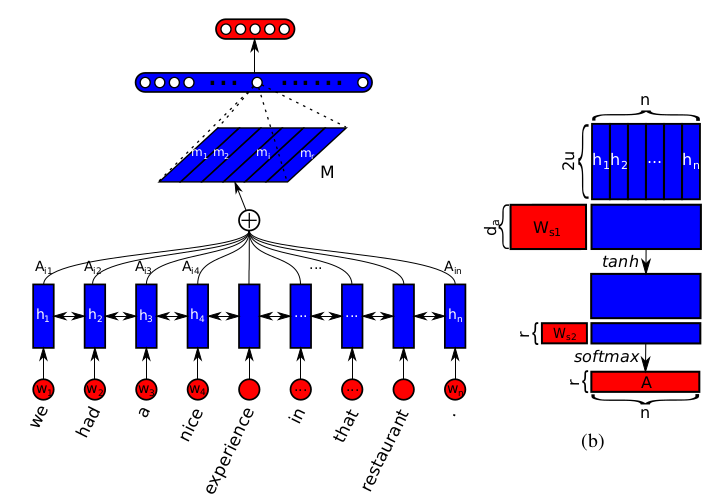

# [A Structured Self-attentive Sentence Embedding](https://arxiv.org/abs/1703.03130)

**TL;DR** 本文提出了一种基于 self-attention 学习 sentence embedding 的监督学习方法. 使用 matrix 来表示 sentence embedding, 保留了句子的多种特征, 一个行向量表示一种特征. 为缓解行向量的冗余问题 (即行向量之间太相似, 只学到重复特征), 文中引入了一个鼓励行向量学习不同特征的惩罚项.

#### Key Points

* 句子的向量表示往往只关注句子的一个特定成分, 比如相关的词或词组, 从而只学到一种特征. 据此, 本文提出用矩阵来表示句子, 充分考虑句子的不同成分 (词, 词组, 分句等), 从而保留句子的不同特征. 用一个行向量表示一种特征:
    * 文中用 $A=softmax(W_{s2} tanh(W_{s1}H^T))$ 来计算 attention matrix. 其中, $H$ 是 LSTM 状态向量构成的矩阵, $W_{s1}$ 和 $W_{s2}$ 是要学习的权值参数矩阵. 如果将 $W_{s2}$ 替换成向量, 得到的就是一个 attention vector, 此时的计算和一般的 attention vector 计算无异. 只是 $W_{s2}$ 作为矩阵之后, 为保证 attention matrix 的每一行都是一个独立的 attention vector, softmax 只应用于输入矩阵的第二维.
    * 通过 $M=AH$, 就得到了 sentence embedding matrix.
    * 由于 $W_{s1}$ 和 $W_{s2}$ 的大小是固定的, 不同长度的句子学到的 sentence embedding matrix 将是固定大小的 $M$.
* embedding matrix 存在冗余的问题, 即学到的 embedding vector 之间过分相似, 实际只学到了少量几种特征. 为此, 文章引入了一项惩罚:
    * 用 $P=\left\Vert\left(AA^T-I\right) \right\Vert_F^2$ 来度量冗余程度. 其中 $I$ 是单位矩阵, $\left\Vert\left(\cdot\right) \right\Vert_F$ 是 Frobenius 范数: $\left\Vert\left(A\right) \right\Vert_F=\sqrt{\Sigma_{i=1}^m \Sigma_{j=1}^n\|a_{ij}^2\|}$
    * 因此, 减小 $P$ 将鼓励 $AA^T-I$ 向零阵看齐. 由于减了一个单位矩阵, 随着学习, $AA^T$ 的对角元素将接近于 1. 按文中的说法, 这将使得每一个 attention vector 尽可能专注于一种成分, 即一种特征, 同时不同 attention vector 又尽可能不同.
* 使用矩阵表示句子带来了一个问题, attention layer 的后接 FC (全连阶层) 将变得很臃肿. 事实上, 文中使用的模型, 90% 的参数都集中在这个 FC 上, 设 $M$ 的大小为 $r\times u$, FC 有 b 个单元, 此时参数量将是 $r\times u \times b$.
* 文中根据矩阵的二维特点, 提出了一种 weight pruning method. 具体地, 将 $M$ 按行映射为 $M^v\in R^{r\times p}$, 使得 $r\times p=b$, 其中 $M^v$ 的第 r 行只和 $M$ 的第 r 行全连接, 这样就剪除了 $(r-1)/r$ 个参数 (按列映射的情况类似). 不过 weight pruning 会带来性能下降.

#### Notes/Questions

* embedding matrix 的想法很具有创新性, 让人眼前一亮.
* 除了 weight pruning 部分, 模型不复杂, 就是 Bi-LSTM + self-attention mechanism.
* 从考察 $M$ 的行数对模型性能的影响的实验来看, 当行数取 1, 即 embedding matrix 退化为 embedding vector, 模型的性能有明显下降, 和 baselines 处于同一级别. 很难说文中提出的模型的性能提升来自 self-attention mechanism 还是 embedding matrix. 怕是 embedding matrix 更多一些, 感觉这是变相的 ensemble 啊.
* 模型对于 sentence representation 的学习是依赖于具体的 NLP 任务的监督学习方法.
* 在惩罚项部分, 文章考虑过 KL 散度, 放弃的原因可以借鉴:
    1. 对于 $A$, 面临的是最大化不同 attention vector 之间的 KL 散度集的问题. $A$ 中大量的零值使得训练不稳定;
    2. 作者希望 $A$ 的每一行专注于句子的一种特征, 这是 KL 散度无法提供的.
* 个人感觉, 文章附录部分写得很难懂, 而且使用的符号和正文不一致. $r\times p =b$ 的依据, $(r-1)/r$ 是怎么出来的, 都没讲清楚.
