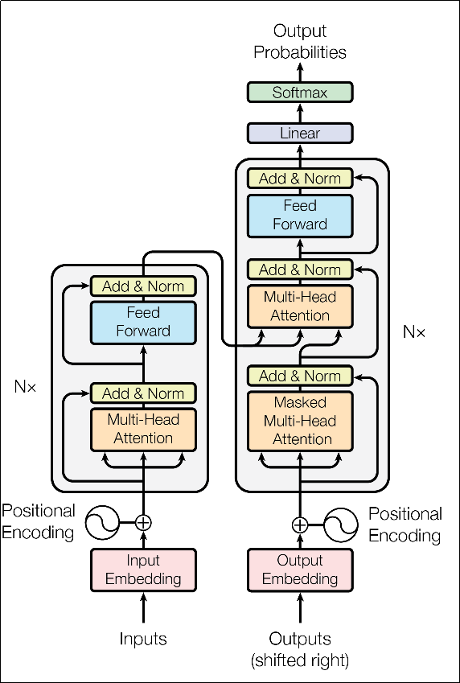

# Attention is All You Need

**TL;DR** 本文提出了基于 _Attention Mechanism_, 而完全不使用 RNN 或 CNN 的 Sequence Transduction \(Seq2seq\) 模型 _Transformer_. 其采用 _Self Attention_ 来学习序列的表示, 具体的是: _Scaled Dot-Product Attention_. 为解决位置信息 \(Position Information\) 丢失问题, 模型将 _Positional Encpding_ 与 Input Embedding 结合; 为防止 decoder 中后续位置 \(模型可并行计算\) 对前面位置的影响, 模型在 decoder 中使用了 Mask 以使位置 $i$ 处的预测只依赖于前面的输出.

## Key Points

* 完全放弃了 RNN 和 CNN, 仅依赖 Attention Mechanism 来对序列进行建模.
* 提出了 Scaled Dot-Product Attention: $Attention\(Q, K, V\)=softmax\(\frac{QK^T}{\sqrt{d_k}}\)V$. 其中 Q 表示 query 的矩阵, K 表示 key 的矩阵, V 表示 value 的矩阵. 这个式子与 Dot-Product Attention 的区别在于多了一个分母 $\sqrt{d\_k}$. \(根据文章脚注的说法: 点积会随 $d\_k$ 的增大而增大, 从而使得 softmax 的梯度饱和. 假设 query 和 key 的值是均值为 0, 方差为 1 的独立变量, $q\cdot k=\Sigma_{i=1}^{d\_k} q\_i k\_i$ 的结果的方差将是 $d\_k$\)
* 提出了 _Multi-Head Attention_, 不止算一次 Attention, 而是对 Q, K, V 做了 $h$ 次线性变换, 得到 $h$ 个平行的 Q, K, V, 计算了 $h$ 次 Attention, 然后对 attentions 做一次 concatenation + 线性变换. 公式: $MultiHead\(Q, K, V\)=Concat\(head\_1, \dots, head\_h\)W^O$, 其中 $head\_i=Attention\(QW\_i^Q, KW\_i^K, VW\_i^V\)$
* encoder 使用的单元是 _multi-head attention + fc_ 的二层结构, 并使用了_残差连接 residual connection_ 和 _layer normalization_; decoder 的单元是一个三层结构: _masked multi-head attention + multi-head attention + fc_.
* 模型全程使用 Attention, 在 encoder 和 decoder 中使用 self-attention 来学习序列表示, 即 Q=K=V; 使用 encoder-decoder attention 将 encoder 与 decoder 连接起来. 注意, encoder-decoder attention 不是 self-attention, 因为 keys, values 来自 encoder, queries 来自 decoder.
* 在 decoder 中, 为使位置 i 处的预测仅依赖于前面的输出, 在 scaled dot-product attention 内使用了 mask.
* 不使用 RNN 与 CNN 带来了位置信息丢失的问题. 为此, 模型将 Input Embedding 与 Positional Encoding 相结合. 文中使用了 sine 和 cosine 函数来编码位置信息. $PE\(pos, 2i\)=sin\(pos/10000^{2i/d_model}\)$; $PE\(pos, 2i+1\)=cos\(pos/10000^{2i/d\_model}\)$. 对此, 文中的解释是: 该方法可以将相对位置注入模型, 因为对于任意固定的偏移量 $k$, $PE_{pos+k}$ 都是 $PE\_{pos}$ 的线型函数; 此外, 该方法还能应付序列长度超出所有训练样本的情况.
* 使用 self-attention 学习序列表示的 3 个优点:
  1. 每层的计算复杂度降低了; \(RNN 真的是很复杂很复杂啊\)
  2. 计算可并行;
  3. 缓解了_长期依赖 long-range dependencies_问题. \(使用 self-attention, 所有位置间的距离是一个常数. 带来的问题是, 每次 query 都得遍历整个输入序列, 对于超长序列, 计算开销极大.\)
* 学习率的更新很有意思: $lr=d\_{model}^{-0.5}\cdot min\(step^{-0.5}, step\cdot warmupstep^{-1.5}\)$ 效果是, 在 wampup 阶段, 学习率增大, 之后再减小.
* Regularization 技巧:
  1. Residual Dropout: 在每一个子层之后进行 dropout. 对 embedding 与 positional encoding 的和应用 dropout.
  2. Label Smoothing: 训练时使用. 伤害了 _perplexity_, 但提高了 accuracy 和 BLEU.
* 训练时, batch 应该是不固定的. 根据句子近似序列长度来组织 batch, 使得每一个 batch 包含约 25000 个 source token 和 25000 个 target token.

## Notes/Questions

* 我对本文的几个存疑:
  1. Positional Encoding, 公式很显然, 但暂时想象不出;
  2. batch 的设置的优点何在;
  3. multi-head attention 的头数太多时, 模型性能反而下降, 难道不应该和残差网络的基本思想一样, 至少不伤害吗;
* Attention Mechanism 与 RNN 并不矛盾, 在之前的模型中都是一起使用的, 但是 RNN 太复杂, 太慢. 希望注意力之于序列建模就像 word2vec 之于 word embedding.
* 论文的题目取得也太大了- -.

