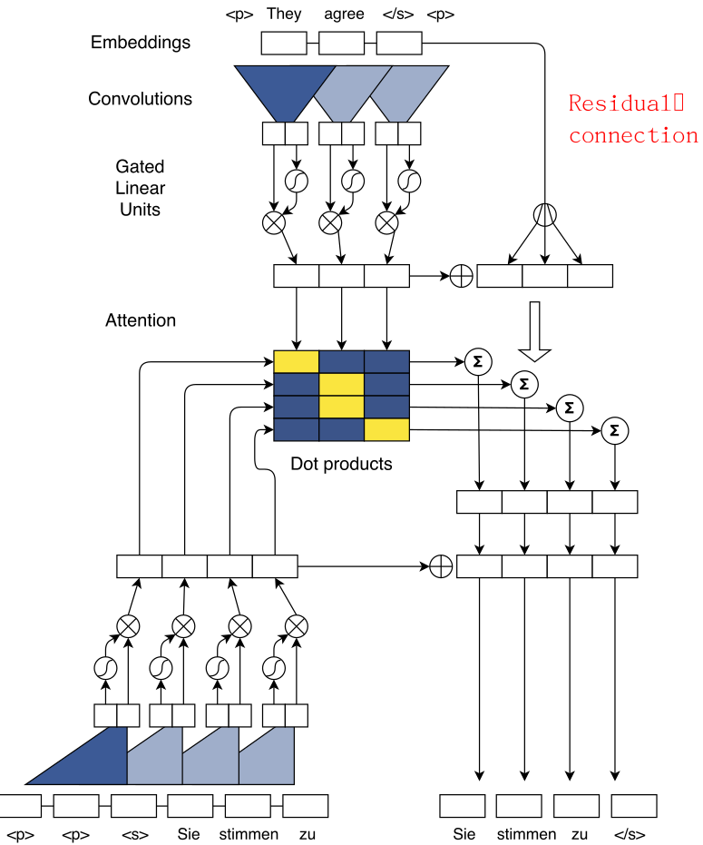

# Convolutional Sequence to Sequence Learning

## TL;DR

本文提出了完全基于 CNN, 外带 Attention 的 Seq2Seq 模型 ConvS2S, 在多项翻译任务上都击败了 LSTM-based 模型. 由于抛弃 RNN 带来的可并行性, ConvS2S 在 GPU 和 CPU 上的速度都快了一个数量级. Conv2S2S 属 Encoder-Decoder 架构, encoder 和 decoder 都以卷积层+GLU \(gated linear unit\) 为基本单元, 采用 Multi-step Attention, decoder 的每一层都对应一个独立的 attention, attention 的计算方式与常规略有不同.

## Key Points

* 指出 CNN 用于序列建模的优势:
  * 多层结构的 CNN 可以学习输入序列的分层表示, 靠近的输入在低层进行交互, 远距离的输入开在高层实现交互;
  * CNN 的分层结构相比 RNN 的链式结构, 能用更短的路径捕获_长期依赖 long-range dependency_;
  * 输入序列经固定数量的卷积核与非线性变换, 而 RNN 对长度为 n 的序列, 对于第一个元素操作 n 次, 而对最后一个元素只操作 1 次.
* ConvS2S 对输入的元素和位置都进行了 embedding, 得到 token embedding 和 position embedding, 将两者简单相加作为 encoder 的输入. 此外, 对于 decoder 生成的输出, 再次输入 decoder 时, 也要加上 position embedding.
* Encoder 和 decoder 都采用_卷积层+ GLU_ 的单元作为基本结构. 两者都由多层这样的结构组成.
* 当卷积层使用大小为 k 的核时, 计算得到的中间状态将包含 k 个输入元素的信息. 多层叠加之后, 每个顶层状态将包含更多的输入信息.
* 卷积核的参数为 $W \in \mathbb{R^{2d\times kd}}$, 这意味着它将 $X\in \mathbb{R^{k\times d}}$ 的输入矩阵映射为 $Y\in \mathbb{R^{2d}}$ 的输出矩阵 \(d 是 embedding dim\). 使输出元素的维数是输入的两倍, 是为了适应 GLU.
* GLU: $v\(\[A B\]\)=A\otimes \sigma\(B\)$, 以 $\sigma\(B\)$ 为门, 控制当前上下文中的哪个输入 A 是相关的. 卷积层的输出可以看作 $Y=\[A B\]\in \mathbb{2d}$.
* 文中使用 GLU 是因为它在 language modelling 上比其他非线性变换更好.
* 为训练更深的模型, 引入了_残差连接 residual connection_, 将卷积层的输入连接到 GLU 之后. 残差连接的输出必须与 GLU 的输出具有相同尺寸. GLU 不改变输入输出大小, 而卷积层会使得维数翻倍. 对于 encoder, 对残差连接的输出 \(亦即卷积层的输入\) 进行 zero padding 即可; 对于 decoder, 要屏蔽未来的信息, 文中的做法是先对两边都进行 padding, 然后去掉卷积层输出的右边 k 个元素.
* ConvS2S decoder 的每一层都有一个独立的 attention, 称为 _Multi-step Attention_. 相比 single-step attention 的优势是, 可以由粗到细地确定 attention, 比如第一层的 attention 用于确定输入序列的有效上下文, 将这一部分输入到第二层, 而第二层计算 attention 会考虑这些信息, 从而更准确地对齐.
* ConvS2S 的 attention 计算略有别于普通 attention:
  1. 将当前时刻当前层 decoder 的状态与前一时刻的生成的 embedding 结合, 作为 decoder state summary: $d\_i^l=W\_d^l h\_i^l+b\_d^l+g\_i$ \(l 表示第 l 层, i 表示第 i 个状态\);
  2. 计算 decoder state summary 与 encoder 最后一层的输出的对齐程度, 得到 attention weight: $a_{ij}^l=\frac{exp\(d\_i^l \cdot z\_j^u\)}{\Sigma_{t=1}^m exp\(d\_i^l \cdot z\_t^u\)}$ \($z^u$ 表示 encoder 最后一层的输出\);
  3. 计算 attention 时, 考虑 encoder 的 input embedding: $c_i^l=\Sigma_{j=1}^m a\_{ij}^l \(z\_j^u + e\_j\)$ \($e\_j$ 代表 encoder 在 j 时刻的输入\);
  4. attention $c\_i^l$ 简单地加到 $h\_i^j$ 中, 作为后续的输入.
* 文中发现, $e\_j$ 的确有帮助, 它起到类似 key-value memory network 的作用, 以 $z\_j^u$ 为 key, $z\_j^u + e\_j$ 为 value. $z\_j^u$ 作文输入上下文的表示, $e\_j$ 则提供了当前位置的元素的具体信息.
* 文中使用了一系列 normalization 策略来稳定网络的学习 \(以下方法都是基于某种假设的, 并不总是成立, 但文章发现实际是有帮助的\):
  * 对残差单元的输出和 attention 都进行缩放, 以保持 activation layer 的方差稳定;
    * 将残差单元的输入输出和乘以 $\sqrt{0.5}$ 来减半求和的方差;
    * 通过缩放 $m\sqrt{1/m}$ 来抵消 attention 方差的变化;
    * 将 attention 的输入乘以 m;
  * 用 attention 的数量来缩放 encoder 的梯度;
* 文中还特地使用了一些 initialization 策略, 目的同样是在前向与反向传播中保持 activation 的方差:
  * embedding 统一由均值为 0, 标准差为 0.1 的正态分布来初始化参数;
  * 对于不直接输出到 GLU 的层, 权值参数由正态分布 $N\(0, \sqrt{p/n\_l}\)$ 来初始化 \(p 是 dropout 的保持概率, 此处用于抵消使用 dropout 带来的方差变化, 下同\);
  * 对于输出到 GLU 的层, 使用正态分布 $N\(0, \sqrt{4p/n\_l}\)$ 初始化参数 \(依据是: GLU 的输入服从均值为 0, 方差足够小的分布时, 其输出方差近似为输入的 1/4\).
* 学习率在 validation perplexity 停滞时, 下降一个数量级, 并最终停止于 0.0001.
* 生成翻译时, 遇 unknown, 基于 attention score 从预先计算出来的词典中选词替换; 当词典中不存在相应翻译时, 直接对源词进行拷贝.
* 实验部分证明
  * position embedding 对于性能提升有帮助. Encoder 中的 position embedding 影响更大. Decoder 能一定程度上从上下文中学习到相对位置信息, 因为高层 decoder 的感受野足有 25 个词左右;
  * 减少 attention 会降低模型性能, 由于计算可并行, multi-step attention 带来的计算开销并不大;
  * 更小的 kernel, 更深的网络, 更好的性能. 这一点对于 encoder 更明显

## Notes/Questions

* 尽管文中简单提了一句, 交替使用 block 和 layer 的说法, 阅读的时候还是会偶尔犯迷糊. 既然如此, 为什么不统一表述呢? 引以为戒.
* 文中说: 非线性变换使得网络能利用全部的输入, 或专注于需要的少数元素. 这一点, 我还没理解.
* FAIR 的论文实验都很详细, 训练的一些技巧也很有启发.
* 在 Transformer 问世之前, ConvS2S 短暂地在多项任务上取得了 SOTA 的结果. 不知道 FAIR 会否感叹: 既生 ConvS2S, 喝生 Transformer.
* Github 上项目中的动态很形象地描绘了 ConvS2S 的计算过程, 但过于抽象. 而文中的示意图由于对一些操作进行了简化, 也不是太清晰.

