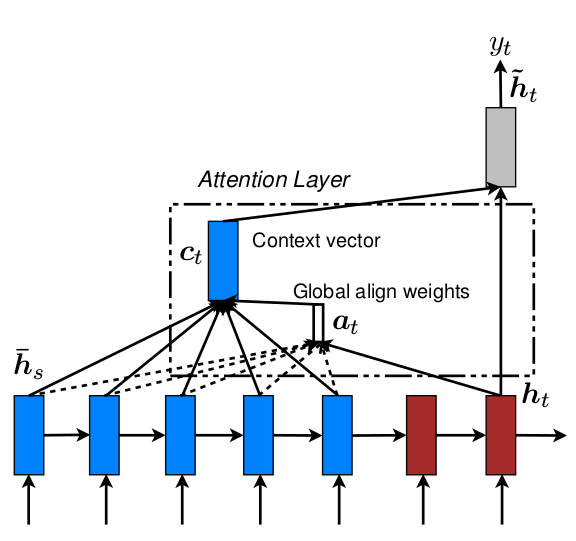
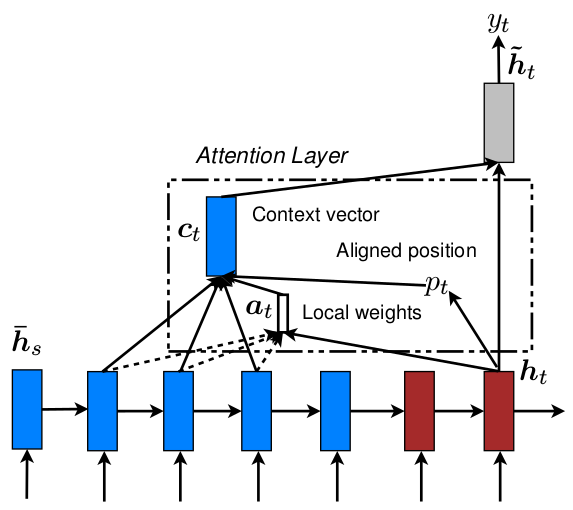

# Effective Approaches to Attention-based Neural Machine Translation

## TL;DR

本文对 attention model 进行了研究, 提出了 2 类 attention model: `global attention` 和 `local attention` 和 3 种 alignment function. 顾名思义, global attention 考虑 source 的所有状态; 而 local attention 仅考虑局部状态, 减少了计算开销. Local attention 需要估计对齐点, 文中介绍了 2 种方法:

1. 按位置递增法 \($p\_t=t$\);
2. 预测法 \($p\_t=S\cdot \sigma\(v\_p^T tanh\(W\_p h\_t\)\)$\).

文章提出的 3 种 alignment function 分别是:

1. dot \($h\_t^T \overline{h\_s}$\); 
2. general \($h\_t^T W\_a \overline{h\_s}$\);
3. concat \($v\_a^T tanh\(W\_a\[h\_t;\overline{h\_s}\]\)$\).

此外, 文中还介绍了 `input-feeding approach`, 该方法考虑 past alignment information 来帮助当前的对齐决策. 具体做法是将前一时刻的 `attention vector` $\tilde{h\_{t-1}}$ 与当前时刻 decoder 的输入拼接作为最终 decoder 的输入.

## Key Points

* 提出了 2 类 attention model: global attention 和 local attention. 前者在 source 的所有状态上考虑 attention distribution; 后者只考虑局部范围内的 attention distribution.
* 提出了 3 种计算 decoder 状态 $h\_t$ 和 encoder 状态 $h\_s$ 的对齐程度方法:
  1. `dot`: $score\(h\_t, \overline{h\_s}\)=h\_t^T \overline{h\_s}$;
  2. `general`: $score\(h\_t, \overline{h\_s}\)=h\_t^T W\_a \overline{h\_s}$;
  3. `concat`: $score\(h\_t, \overline{h\_s}\)=v\_a^T tanh\(W\_a\[h\_t;\overline{h\_s}\]\)$.
* \(实际上, 文中还提到了一种基于位置来计算对齐程度的方法 location-based function: $score\(h\_t, \overline{h\_s}\)=W\_a h\_t$. 这甚至都没有考虑 source 的状态, 笔者不认为这算对齐.\)
* 如上所示, 本文的 attention 计算流程是: $h_t\rightarrow a\_t \rightarrow c\_t \rightarrow \tilde{h\_t}$. \(Bahdanau 那篇是 $h_{t-1} \rightarrow a\_t \rightarrow c\_t \rightarrow h\_t$.\)
* Local attention 是 soft attention 和 hard attention 的折中方法. 所谓 soft attention 就是 global attention, 只是本文为和 local 做区分换了个名字, 通过对所有相似度做 softmax, 每对 source-target 状态都有相似概率, attention 连续可微; 而 hard attention 就是简单粗暴地取一个 source 状态, attention 不连续可微, 无法使用 BP 算法.
* Local attention 的具体方法是: 为每个 target word 生成一个对齐位置 $p\_t$, 然后取其左右大小为 D 的窗口计算 $c\_t$. 由于 D 是固定的, alignment vector $a\_t$ 的是一个定长向量.
* 文中介绍了 2 种生成对齐位置的方法:
  1. `Monotonic alignment`: 此时假设 source 和 target 序列是单调对齐的, 简单地说, target在 t+1 时刻对齐的 source 状态不会出现在 t 时刻之前;
  2. `Predictive alignment`: 此时使用一个预测模型来预测对齐位置. $p\_t=S\cdot \sigma\(v\_p^T tanh\(W\_p h\_t\)\)$ \(此处$\sigma$ 是 sigmoid 函数, S 是输入序列的长度\). 然后以 $p\_t$ 为中心, 以 `截断高斯分布 truncated gaussian distribution` 作为 attention distribution 计算 alignment vector: $a\_t\(s\)=align\(h\_t, \overline{h\_s}exp\(-\frac{\(s-p\_t\)^2}{2\sigma^2}\)$ \(文中并没有将 $p\_t$ 处理成整数, 但 $s$ 确是落在窗口内的整数\)
* 受传统 MT 维护一个 coverage set 以追踪已经翻译的单词的启发, 文章提出了 `input-feeding approach`, 即在对齐决策时, 考虑过去已经使用过的对齐信息. 具体做法很简单, 就是将上一时刻的 attention vector $\tilde{h\_{t-1}}$ 和当前时刻 decoder 的输入共同作为 decoder 的输入.
* 一些实验发现包括:
  * `perplexity` 确实与翻译质量强相关;
  * input-feeding approach 是有帮助的;
  * attention model 对 unknown words 也能学到有用的对齐信息 \(基于使用 \ 替换低频词的实验结果比不使用该技术的结果更好\):
  * global attention + dot 效果不错, general 与 local attention 更搭;
  * attention model 对于名字的对齐效果特好 \(中文姓在前名在后, 英文名在前姓在后, 这样的关系\);
* 下图分别是 global attention model 与 local attention model:

## Notes/Questions

* 本文一些存疑的地方:
  * 文章提到论文 \ 在目标函数中使用一个 additional constraint 来确保模型对图片所有部分有相同的关注度. 那篇我还没看, 该方法的目的与效果有待后续补充. 但本文说 input-feeding approach 能提供对于 additional constraints 的灵活选择, 语焉不详, 没理解.
  * 不知道该如何评价 attention model 对学习名字的超强能力. 在我看来, 名字是一个专有名字, 是一个整体, 该能力的用处有多大, 见仁见智吧.
  * 文中使用了 `alignment error rate, AER` 指标来评估对齐的质量, 但具体做法没有介绍, 给了一个分数就了事了, 最后得出结论: AER 与翻译质量相关度不大. 让人着摸不透. 不如 Bahdanau 那篇上图来得直观.

