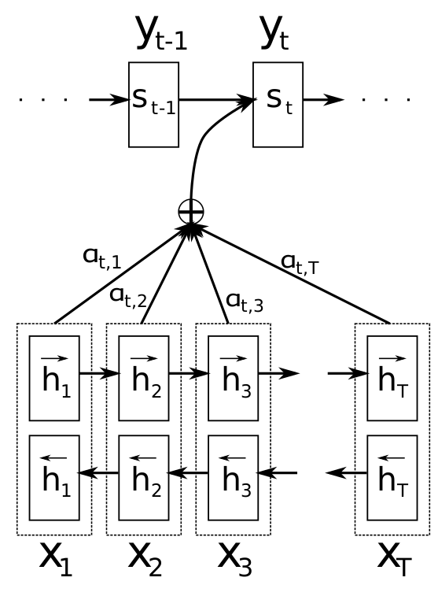

# Neural Machine Translation by Jointly Learning to Align and Translate

**TL;DR** 本文是将_注意力机制 Attention Mechanism_ 引入机器翻译的第一文, 文中称为_对齐 Alignment_. 在_编码器 encoder_ 与_解码器 decoder_ 之间增加了一个_对齐模型 alignment model_, 使得翻译不再是将 source 编码成固定长度的_上下文向量 context vector_ 再解码成 target, 而是维护一个可变的 context, 每翻译一个词, 都从 source 中搜索最相关的部分与之对齐. 由于使用的 soft-alignment, 梯度可通过 alignment model 反向传播, 因此同时学习翻译与对齐.

## Key Points

* 指出传统 encoder-decoder 框架的不足之处. 随着序列的增长, 将输入的所有信息压缩进一个固定长度的向量越来越困难, 模型性能将急剧下降.
* 为解决上述问题, 引入了 aligment model, decoder 每生成一个词的翻译, 都会对输入序列进行搜索, 找出与当前要翻译的内容最相关的部分; 结合之前的输出, 当前 decoder 的状态和查询结果, 进行更好的翻译.
* 给出了 alignment model 的一个范式:
  * 综合各要素计算下一个翻译的概率: $p\(y_i\|y\_1, \dots, y_{i-1}, x\)=g\(y\_{i-1}, s\_i, c\_i\)$; $s\_i$, $c\_i$ 分别是 decoder 第 i 时刻的 state 与查询得的 context.
  * 根据之前的输出, 状态和当前 context 计算当前状态: $s_i=f\(s_{i-1}, y\_{i-1}, c\_i\)$;
  * context vector 是加权求和的结果: $c_i=\Sigma_{j=1}^{T_x} \alpha_{ij}h_j$; $h\_j$ 是 endoder 在第 i 时刻的状态, $\alpha_{ij}$ 是对应的权值.
  * 使用 decoder 的上一个状态计算和 encoder 某时刻状态的相似度, 即对齐程度: $e_{ij}=a\(s_{i-1}, h\_j\)$; \(按照原文的表示, 此处为小写的 A\)
  * 概率和为 1, 因此使用 softmax, soft-alignment 由此得名: $\alpha_{ij}=\frac{exp\(e_{ij}\)}{\Sigma_{k=1}^{T\_x} exp\(e_{ik}\)}$. \(此处为希腊字母 alpha, 表征概率\)
* 对齐时, 在整个输入序列上搜索相关部分, 每个词都以一定概率和翻译结果对齐, 好处是可以考虑更多的上下文信息, 并很自然地解决了词组的翻译问题, 带来的问题是, 对于 $T\_x$ 长度的 source 和 $T\_y$ 长度的 target, 要进行 $T\_x \times T\_y$ 对齐运算.
* 具体地, 文中使用感知机来计算相似度, 即 $a\(s_{i-1}, h\_j\)=v\_a^T tanh\(W\_a s_{i-1}+U\_a h\_j\)$

## Notes/Questions

* 从概率的角度看, translation 可以理解为 conditional language modeling. 即找出最优的翻译, 最大化 $p\(target\|source\)$ 的概率.
* 用 $s_i=f\(s_{i-1}, y\_{i-1}, c\_i\)$ 来计算状态, 抛弃了 decoder RNN 的状态, 总觉的挺别扭的.
* 给出了 Attention 的一个范式, 但计算方法上还比较粗糙, 这也为后面的各种论文提供了发挥空间.

