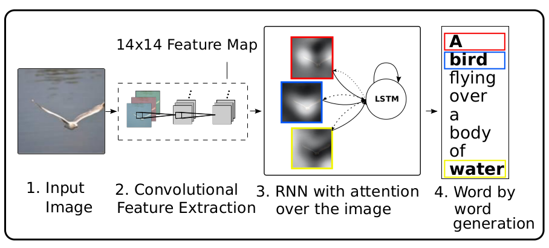

### [Show, Attend and Tell: Neural Image Caption Generation with Visual Attention](http://proceedings.mlr.press/v37/xuc15.html)

#### TL;DR

由于 *Image Caption* 可以看作图片到文字的翻译, 本文使用了 Encoder-Decoder 的框架, 并继承并发扬了本论文发表之前大获成功的注意力机制. 文中使用了 *Hard Attention* 和 *Soft Attention* 两种注意力机制, 并证明了后者对前者的一种近似. Hard attention 选择单点作为注意力点, 结果不可微, 使用强化学习的方法进行优化; soft attention 同 NMT 中一般.

#### Key Points

* 考虑到 Image Caption 模型将图片压缩一个向量, 再从这个向量生成文字描述, 会丢失丰富的信息 (同非 attention-based NMT 一样). 本文引入了注意力机制, 动态地搜索与生成文字最匹配的图片部分, 此时不再使用 CNN (encoder) 最后输出的向量来初始化 RNN (decoder) 的状态. 而是使用更多的低层表示以保持更丰富的局部特征, 类似 RNN 每个时序的输出状态. Decoder 的工作流程与 NMT 的无异.
* 模型结构为: CNN/Encoder -> Attention Layer -> LSTM/Decoder.
    * CNN 生成 L 个 D 维向量 $\alpha=\{a_1, ..., a_L\}$, 文中称为 *annotation vector*, 每个向量对应图片的一块区域;
    * Attention layer 按部就班地计算 alignment score $e_{ti}$, 通过 softmax 转为 attention weight $\alpha_{ti}$, 再计算 context vector $\hat{z_t}$. 在计算 context vector 上, 文中使用了 hard attention 和 soft attention 两种方法;
    * LSTM 的初始 cell state 与 hidden state 由 annotation vectors 的均值 $\Sigma_i^L a_i / L$ 经不同的 MLP 得到;
    * 模型输出是上一时刻的输出, 当前时刻的 LSTM hidden state, context vector 的函数: $p(y_t|a, y_1^{t-1}) \propto exp(L_o(Ey_{t-1}+L_h h_t + L_z \hat{z_t}))$.
* Stochastic Hard Attention (尚未打通 RL 的任督二脉, 在理解的基础上尽量保持原文原意)
    * 此时将注意力点当作 latent variable, $\hat{z_t}$ 计算如下 ($s_{t,i}$ 是一个指示变量, 以 one-hot 形式表示, 当第 t 个词与第 i 个位置对齐时, 相应位置取 1):
        * $s_t \sim Multinoulli({\alpha_i})$, 位置变量 $s_t$ 是以 $\alpha_i$ 为参数的 Multinoulli 分布;
        * $p(s_{t, i}=1|s_j\<t, a)=\alpha_{t, i}$, attention weight $a_{t, i}$ 作为 t 时刻选中 i 位置的概率;
        * $\hat{z_t}=\Sigma_i s_{t, i}a_i$, 由于 $s_{t, i}$ 以 one-hot 形式表示, 有且仅有一个图片位置会被选中.
    * $\hat{z_t}$ 的计算方式导致 attention 不连续, 不能使用 BP 来优化, 文章用边缘对数似然的变分下界作为目标函数:
        * $L_s=\Sigma_s p(s|a)logp(y|s,a)\le log\Sigma_s p(s|a)p(y|s, a)=logp(y|a)$.
    * 文中使用基于蒙特卡罗的采样近似法来估计参数梯度, 并采用移动平均基线来减小蒙特卡罗估计量的方差:
        * $b_k = 0.9\times b_{k-1}+0.1\times log p(y|\tilde{s_t},a)$, 此处 $\tilde{s_k}$ 是从 Multinoulli 分布采样的位置;
    * 为进一步减少蒙特卡罗估计量的方差, 在参数梯度中增加来基于 multinoulli 分布的熵 $H[s]$; 此外, 以 0.5 的概率将 $\tilde{s}$ 设为它的期望值 $\alpha$ (应是相对于采样而言). 综上, 参数的梯度近似为:
        *  $\lambda_r$ 与 $\lambda_e$ 是由交叉验证选择的超参数.
    * 使用强化学习来求解, 奖励为采样的*注意力迹 attention trajectory* 下, 与目标句子的对数似然成比例的实值.
* Deterministic Soft Attention
    * 以 conetxt vector 的期望作为 attention: $\mathbb{E}_p(s_t|\alpha)[\hat{z_t}]=\Sigma_{i=1}^L \alpha_{t,i}a_i$, 也就是 NMT 中计算 attention 的一般方法;
    * 文中介绍了 soft attention 是注意力位置上边缘似然的近似, 并给出了相应证明, 鉴于笔者实在看不懂这部分内容, 就不写出来误导读者了;
    * 为鼓励模型对图片各部分施加相同的注意力, 文中引入了 douly stochastic regularization, 使得 $\Sigma_t a_{ti}$ 并不恰好等于 1, 而是 $\Sigma_t a_{ti}\approx \tau$, 而 $\tau \ge \frac{L}{D}$. 本文实验证明, 该惩罚项提高了 BLEU, 并且有助于产生更丰富更具有描述性的 caption.
    * 此外, 文章还让 soft attention 在每个时刻 t, 基于上一时刻的 LSTM 状态预测一个门控标量 $\beta$. 实验证明 $\beta$ 能使得 attention weights 更强调图中的物体
        * $attention=\beta \Sigma_i^L \alpha_i a_i$;
        * $\beta_t=\sigma(f_\beta (h_{t-1}))$.
* 在所有比较中, 本文提出的模型都取得了 SOTA 的结果, 而且 除了两项指标, Hard-Attention 总是好于 Soft-Attention.

#### Notes/Questions

* 本文的符号使用情况有些混乱, 为阅读带来了更多的挑战, 自己写论文要引以为戒.
* 我有些怀疑 [A Structured Self-attentive Sentence Embedding](https://arxiv.org/abs/1703.03130) 使用 Embedding Matrix 以保留句子更多特征的想法部分来自此文, 文中保留了 L 个 D 维向量, 以保留图片的低层特征.
* Hard-Attention 比 Soft-Attention 效果更好, 有点出乎意料. 如果是因为 Hard-Attention 的注意力更集中, 那么对 Soft-Attention 施加一个 Squash Function, 压缩小概率, 相比常规 Attention 应能带来提升. 待验证.
