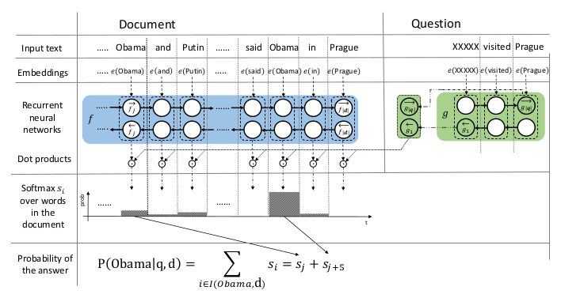

# Text Understanding with the Attention Sum Reader Network

论文地址: [https://arxiv.org/abs/1603.01547](https://arxiv.org/abs/1603.01547)

## TL;DR

本文基于\(机器阅读的\)答案出自材料的思想, 提出了 _Attention Sum Reader, ASReader_, 以 question embedding 作为 query, 通过注意力机制计算它与 context document 中各单词的相关程度, 即各单词是答案的概率, 最后求各 unique word 的总得概率, 最高者即为答案.

## Key Points

* 本文提出了 Attention Sum Reader 模型, 流程如下:
  1. 对 question 进行编码得到一个向量作为 query \(Bi-GRU 首尾状态的拼接\);
  2. 计算 context document 中的每个单词的 word vector \(称为 contextual embedding\);
  3. 计算 query 与每个 contextual embedding 的 dot product, 再对结果使用 softmax 得到每个单词作为答案的概率, 最后求同一个单词在所有位置上作为答案的概率和, 最高者为答案.

## Notes/Questions

* ASReader 的答案出自材料. 这是一把双刃剑. 一方面它摒弃掉了 vocabularity 中其他的词, 99.9% 是噪声, 使得模型更简单更专注; 但对于复杂的情况, 答案不在 document 中, 需要再推理一下的情况就不太适用了. \(关于这一点, 我觉得可以用一个 mask 来做一个权衡, 此时相当于不在 document 中的词的值都是 0, 可以用一个比较小的值来代替, 这样真正作为答案的词依然能出头\).
* 本文提出的模型很简单, 但嘈点颇多:
  * 通过概率累加的方法求解答案, 强调了频率高的单词, attention 的作用被弱化了 \(文中演示了一个错误用例\);
  * 有一段很搞笑的分析, 话说一个问题的答案是一月和三月, 一般的 attention model, 两月的权值相等, 加权平均的结果就变成了二月, 且不说 embedding 之后还有其他层对 word vector 进行加工, 就是在 vector space, 月份会聚集在一起, 但也不意味着二月就处在一月和三月的中间 \(就这样的论文, 还发在 ACL2016 上, 审稿人, 喵喵喵?\);
  * 本文取得的 SOTA 是因为使用了 ensemble 方法, single asreader 和 single pre-SOTA 的模型有至少 1.9% 的差距, 科学的做法应该要提供其他模型的 ensemble 版, single vs single, ensemble vs ensemble;
  * 针对上一点, 文中说前人的模型都采用了 dropout, 有助于提升 single model 的性能, 那 single vs ensemble 也说不通, 正确的做法是, 再创建一个 dropout version asreader, 其他方法的 ensemble version 依然需要;
  * 因为另一篇论文中提到本文所采用的数据集给人做也很难, 然后就说 ensemble asreader 已经接近数据集的极限了, 计算机在某些任务上超越人类早就屡见不鲜了吧?
  * 搜了下, 在 openreview 上有一个 short paper 版, 那时候还不含提交到 ACL2016 时新冒出来的模型, 对当时的 baseline 有巨大优势, 后来扩成 long paper, 加了新的 baseline, 只剩 ensemble 有优势了.

