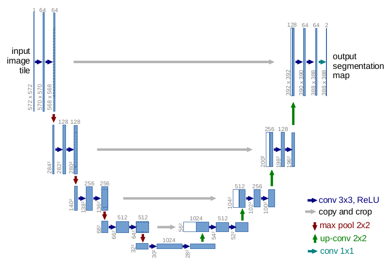

### [U-Net: Convolutional Networks for Biomedical Image Segmentation](https://lmb.informatik.uni-freiburg.de/people/ronneber/u-net/)

#### TL;DR

本文提出了 u-net 的模型结构, 同 ResNet 一样 (早 ResNet 半年发表在 Arxiv 上), 使用了 shortcut connection, 不同的是, 文中使用的是 copy and crop, 从更大尺寸的图像中抠出一块, 拼接到后续层的特征图像中. 属于 Encoder-Decoder, 不过它的提出是为了图像分割, 使用了不同的说辞: 用于捕获上下文信息的 contracting path 和用于精准定位的 expanding path.

#### Key Points

* 全卷积网络 FCN, 在压缩层 (contracting network, 即使图像尺寸变小的层) 之后又多接了几层, 其中用上采样 unsampling 代替了池化, 从而提高了输出的分辨率. 为精确定位, 压缩后的高分辨率特征将结合上上采样的输出.
* U-net 对于 FCN 的修在在于, 在上采样的部分, 保持了相当数量的通道 channel, 使网络能向更高分辨率的层传播行上下文信息. 结果是, 上采样部分近似对称于压缩部分, 使网络结构呈现出 U 性.

* Copy and crop 时, 只使用每个卷积的有效部分. 
* 深度神经网络中, 差的权值初始化会使得部分网络 excessive activation (过激活?), 而另一部分永远没有贡献.

#### Notes/Questions

* 本文应是竞赛论文, 太多图像分割和生物医学的概念了. 不过 U-net 不失为一种比较通用的框架. 在 NLP 中也见到过.
