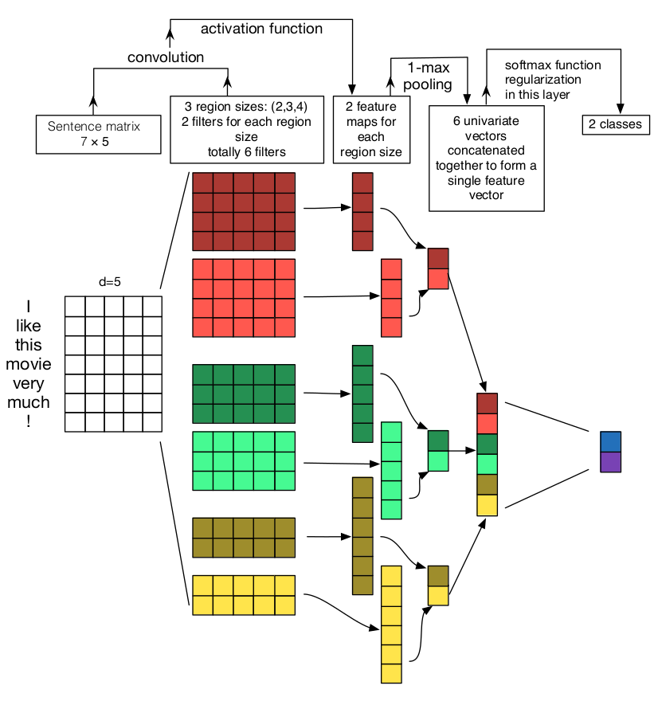

### A Sensitivity Analysis of (and Practitioners’ Guide to) Convolutional Neural Networks for Sentence Classification

论文地址: [https://arxiv.org/abs/1510.03820](https://arxiv.org/abs/1510.03820)

##### TL;DR

本文对用于句子分类的 CNN 做了相对细致的分析, 对于各种参数的选择, 提供了指导意见. 纵观全文, 充分证明了 "没有免费的午餐" 定理.

##### Key Points

* 本文采用 [http://www.aclweb.org/anthology/D14-1181](http://www.aclweb.org/anthology/D14-1181) 提出的 CNN (以下简称 CNN4SC), 网络结构请看之前的笔记, 不再赘述. 就以下几方面进行了研究:
    * 词向量的类型;
    * filter 的区域大小, 即一次卷积考虑多大的窗口;
    * filter 的数量;
    * 激活函数类型;
    * pooling 类型;
    * dropout rate 的取值;
    * l2 范数的取值.
* 根据测试数据的不同, 不同的词向量效果不一.
* 对于不同数据集, 最优的 filter 区域大小不同.
    * 实验证明 **1 到 10** 是一个初步可行的范围;
    * 句子越长, 最优区域大小可能相应会大一些;
    * 使用多个 filter, 尺寸控制在最优值附近能进一步提升性能, 但尺寸偏离最优值过大会损害性能;
    * 有时候使用多个最优尺寸的 filter 的性能会强于使用不同尺寸的 filter, 有时候则反过来.
    * 参数选择的建议是: **使用搜索方法找到最优尺寸的 filter, 然后探索复制同一尺寸的 filter 还是使用不同尺寸的 filter**.
* Filter 数量的选择也取决于数据集. 在一定范围内, 增加 filter 数量能不断提升性能, 超过之后性能反而有所下降 (filter 越多, 训练越慢). 对于句子分类任务, **100 到 600** 是可行的 filter 数量范围.
* 8/9 最优的结果由 Iden (不使用激活函数), **ReLU 或 Tanh** 取得. Iden 的有效性可能是因为对于一些数据集, 线性变换足以捕捉词向量之间的关系了.
* **Global max pooling** 总是完胜 local max pooling 和 average pooling.
* 使用 dropout, **0.1 到 0.5 的 dropout rate**, 能带来轻微的性能提升, 取值随数据集变化.
* 对于本文提出的模型, dropout 的效果不明显的一个原因可能是: 只使用一层卷积层, 参数量比较少, dropout 无用武之地.
* 同 dropout, l2 范数只能带来微不足道的性能提升.
* 随着 filter 数量的增多, 使用 dropout 和较大的范数惩罚能缓解过拟合.
