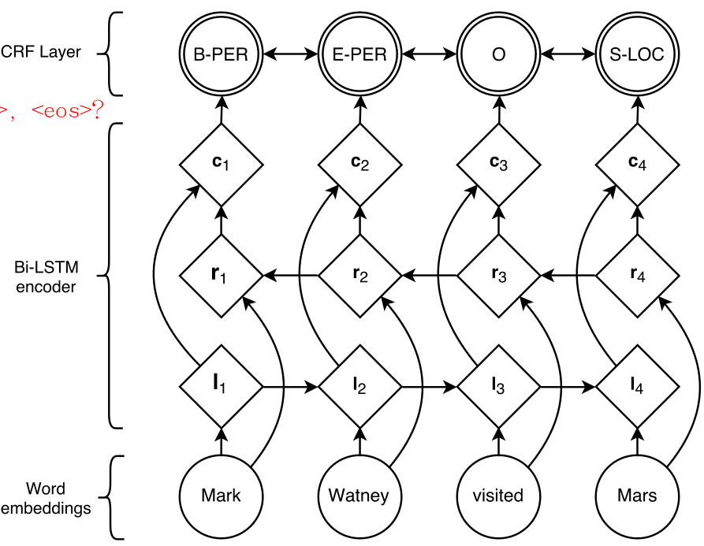

### Neural Architectures for Named Entity Recognition

论文地址: [http://www.aclweb.org/anthology/N16-1030](http://www.aclweb.org/anthology/N16-1030)

##### TL;DR

本文提出了两个 NER 模型, 其中一个基于 Bi-LSTM 和 CRF, 另一个则采用了 transition-based chunking 算法. 两个模型的输入相同, 都是词向量拼接上字符向量的函数.

PS: 实验需要, 这是我看的第一篇 NER 的论文, 会记录得稍微详细点.

##### Key Points

* NER 有两大挑战:
    1. 标注好的语料比较稀缺, 而且通常较小;
    2. 名称的限制少, 意味着可以很随意, 带来了泛化的困难.
* 本文受启发于以下两点:
    1. 考虑到名称常常不只是一个 token (简单点可以理解为单词), 因此, 联合多个 token 进行标签推理会更有帮助;
    2. 在 token-level, 一个 token 可以是名称包括正交证据(名称有什么特点)和分布式证据(名称会出现在语料的何处).
* 针对第一点, 文章提出并比较了两个模型:
    1. LSTM-CRF: Bi-LSTM 后接 CFC;
    2. stack LSTMs (S-LSTM): 使用 stack 结构, 基于 transition, 将输入句子分块, 然后做标记.
* 针对第二点, 文章先学习了一个字符向量模型来捕捉名称的正交性(可以这样理解, 名称通常不是正常的词, 学不到它的 word-level 表示); 然后拼接上词向量, 以此捕捉名称的分布特点.
* 单独使用 RNN 处理 NER 任务, 存在的问题是: 尽管 RNN 的中间状态包含过去的信息, 每个词的标签都是独立的. 而 NER 的标签之间是相互联系的, 具有强依赖性, 比如 B-LOC 不会跟上 I-PER.
* CRF 就是解决这种依赖的. 给定一个句子, 它将输出一个标签的序列. CRF 的训练就是要它从所有可能的标签序列中找出正确的那个.
    * 将句子的序列记作: $X=(x_1, \dots, x_n)$, 预测的标签序列记作: $y=(y_1, \dots, y_n)$'
    * 计算 X 与 y 的匹配程度, 用一个 score 函数表示: $s(X, y)=\Sigma_{i=0}^n A_{y_i,y_{i+1}}+\Sigma_{i=1}^n P_{i,y_i}$.
    * 文中的 CRF 建立在 Bi-LSTM 之上, 因此 P 就是 Bi-LSTM 的输出矩阵, 要注意的是, 它的尺寸是 $n\times k$, k 是标签数, 因此 P 中每个元素都表示一个词与一个标签之间的相关度 (还不能说是概率, 没有经 softmax 处理过) 我看过一些教程, P 也被称为 Emission Matrix;
    * A 则被称为 Transition Matrix, 通俗地讲就是从一个标签转移到另一个标签的分数 (同理不能称为概率), 显然它是一个非对称方阵, 式中的 $y_0$ 和 $y_n$ 是开始和结束的标签, 因此 A 是 k+2 的方阵;
    * 用 softmax 来计算 p(y|X):  ($Y_X$ 是标签序列的解空间);
    * 这种问题, 当然会求对数咯: .
    * NER 可通过**动态规划**来解决, 以避免超大的计算量 (标签序列的解空间大), 文中仅考虑了2-gram 之间的交互.

* 文章发现, 在 Bi-LSTM 与 CRF 之间增加一层, 即对 Bi-LSTM 的输出状态现进行一番变换, 能显著提高模型.
* IOB (inside, outside, beginning) 标签格式, token 是一个名称的首词是, 标记为 B-label, 非首词则标记为 I-label, 否则归为 O.
* 本文采用了 IOBES 格式, 对于一词即一名称的, 用 S-label 标记; 多词名称的尾词用 E-label 标记. 不过在本文的实验中, IBOES 对 IBO 没有明显提升.
* 文章提出的另一个模型 transition-based chunking model, 利用栈来对输入序列进行分块, 将同一名称的多个词分为一块, 再贴上标记.
* 文章设计了一种 chunking 算法来处理序列中各元素:
    * SHIFT: 将缓存中的一个词压入栈 (此处的缓存即为序列中未处理的单词);
    * OUTPUT: 将缓存中的一个词直接压入输出栈 (另一个栈);
    * REDUCE(y): 不同于一般的 pop 操作, 将栈顶元素全部出栈, 即创建了一个块, 标记为 y, 再将这个块压入输入栈.

* 在给定当前栈, 缓存, 输出栈的内容以及历史操作的情况下, transition-based model 输出下一个操作.
* (根据我的理解) 文章使用多个 LSTM 来模拟栈, 缓存, 输出栈, 历史操作, 每一时刻, 根据 chunking 算法, 这 4 部分的内容都会发生改变, 因此能对时间进行建模, 即相当于是对 4 部分都做了一个 embedding, 各自输出一个固定维数的向量. 然后文章再做一个拼接, 以此来求下一个操作.
* LSTM-CRF 和 S-LSTM 的输入相同, 都是词向量拼接上字符向量的函数 (原因见前文). 文章还对词表示应用了 dropout, 发现显著提升了泛化性能.
* 本文用 Bi-LSTM 来学习字符向量, 使用拼接作为组合函数, 将两个方向的末尾向量拼接, 再与词向量做拼接. 文章使用 Bi-LSTM 的预期是: 前向 LSTM 最后的输出能精确地捕捉前缀信息; 反向 LSTM 最后的输出能捕捉前缀信息.
* CNN 是 position-invariant 的, 即前后缀不会被强调(举个例子 ex 作为前缀还是出现在词中并不会有太大差别), 本文的一个假设是, 对于标注型任务, 重要的是位置依赖, 前后缀表达了与词干不同的信息.
* 实验发现: S-LSTM 更依赖于字符向量; LSTM-CRF 通过 Bi-LSTM 能获得更多的上下文信息, 对正交信息的依赖更少

##### Notes/Questions

* 我觉得 NER 和 NMT 很像, 不知道为什么没人用 Seq2seq 的方法来求解. 想找出两者之间的差别, 但最近脑子有些不好, 思考不出来.
* 实验证明 LSTM-CRF 胜过 S-LSTM, 鉴于 S-LSTM 也比较复杂, 建议使用 LSTM-CRF. 后面的论文很多都是采用的类似的方法.
