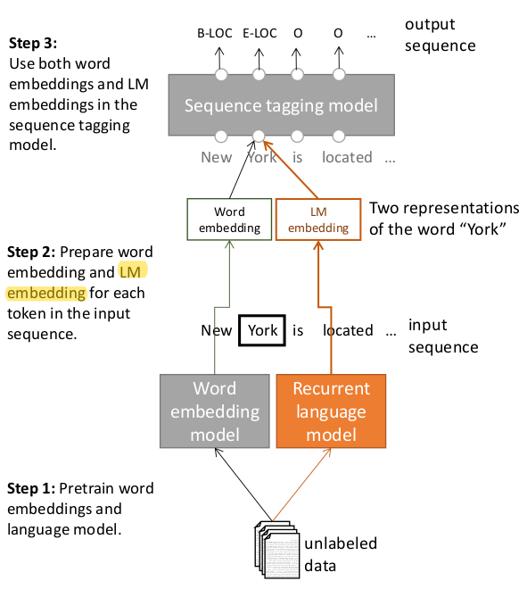
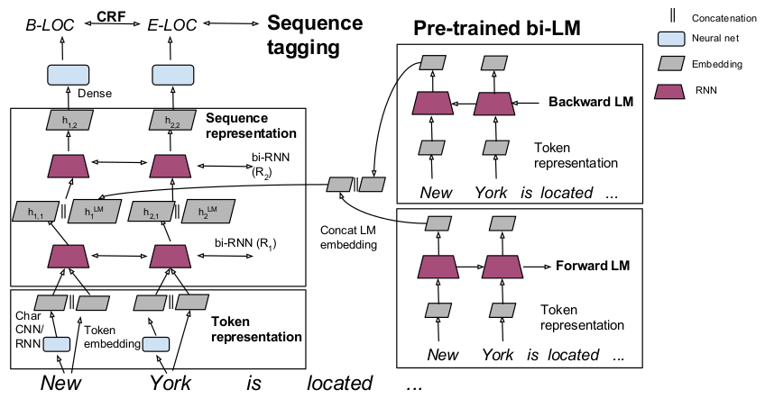

# Semi-supervised sequence tagging with bidirectional language models

论文地址: [https://arxiv.org/abs/1705.00108](https://arxiv.org/abs/1705.00108)

## TL;DR

这篇算是 NAACL2018 最佳论文 \(ELMo\) 的前传, 那篇文章的主要思想在本文都有所提及. 只是论文的目标不一样罢了. 文中引入了 LM embedding, 在 word embedding 之外迁移了从大型语料中习得的上下文特征, 提升了其他任务的性能, 在小型训练集上效果更显著.

## Key Points

* 开篇, 本文就提出了一个尖锐的问题: 许多任务, 单单使用单词本身的语义还不够, 还需要单词的上下文中的语义. 这是本文要解决的问题.
* 对以上问题最简单的解决办法就是用 CNN/RNN 来处理序列, 从而对单词的上下文进行表示. 本文的解决之道就是在大型语料上训练 language model, 学习 LM embedding, 再迁移到其他任务上.
* 以序列标注为例, 本文提出的方法如下:
  * 在大型语料上预训练 word embedding 和 LM embeddidng;
  * 真正进行标注学习时, 计算每个 token 的 word embedding 和 LM embedding, 拼接 \(回忆 ELMo, 前者捕捉上下文无关语义, 后者捕捉上下文依赖语义\);
  * 序列标注的任意模型 \(同昨天的模型类似, 本文采用的是 RNN+CRF\).

* 实验中, 本文使用的已经是 biLM 了, 再具体一点, 弥补下 ELMo 一张图都没有的缺陷:

* 本文对学习率的调整, 关注一下: 先固定学习率学习, 直到在验证集上取得最好的性能, 之后每 5 个 epoch 将学习率缩小 10 倍, 然后重复这个缩小的过程一遍, 结束.
* 当数据量较小时, 计算模型性能的方差很重要.
* 实验表明, 不必在任务相关的语料上预训练 LM \(语料可能比较小\), 在大型任务不相关的语料上训练的 LM 足够捕捉上下文信息了 \(这和 word embedding 多像呀\).
* 实验分析:
  * 本文使用的标注模型使用两层 bi-RNN \(见上图左侧\), 将 LM embedding 注入到第一层 RNN 之后的性能最好, 这可能是因为第二层 RNN 能捕捉任务相关 \(第一层 RNN\) 的上下文与任务无关的上下文信息之间的交互;
  * LM 的尺寸对性能有影响, 甚至可能会减弱性能, 文章对此的分析是, LM 的帮助来自它从大型语料习得有效的组合函数;
  * 对于小型训练集, 从其他大型语料中习得的 LM 对其性能提升最大.

## Notes/Questions

* 题目中所说的 semi-supervised, 含义在于, 在大型语料上学习的 LM embedding 能迁移到其他任务上. 和 ImageNet 上预训练的模型用于其他任务, 以及 word embedding 类似.

