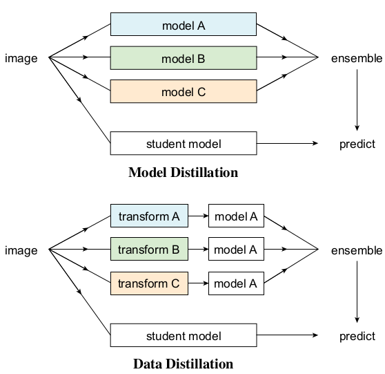

# Data Distillation: Towards Omni-Supervised Learning

论文地址: [https://arxiv.org/abs/1712.04440](https://arxiv.org/abs/1712.04440)

## 要点

本文题目中的"omni"是"全方位"的意思, 所以姑且先称呼"omni-supervised learning"为"全方位监督学习"吧.

怎么个全方位法呢? 根据本文的说法就是: 利用所有可用的数据, 包括来自多个数据集的带标签的数据, 以及网上可获得的无标签的数据.

既从带标签的数据中学习了, 又能从无标签数据中学习, 文章将"全方位监督学习"归为"半监督学习"的一种. 不过文章郑重声明了一点: 大多数半监督学习将全部标记好的数据分成带标签的和无标签的数据, 以此来模拟半监督环境, 因为用于监督学习的数据减少了, 它的能力上限是使用全部标记好的数据进行训练的监督学习模型; 但是, 全方位监督学习, 在全部标记好的数据上进行监督学习之后, 再利用网上的无标签数据进行学习, 能力下限是前面所说的监督学习模型.

为此, 文中介绍了一种"data distillation"的技术. 显然, 和之前介绍的"model distillation"有关系, 关系如下:

法如其名, model distillation 将多个模型\(也可以是一个大的模型\)的知识\(泛化能力\)蒸馏\(迁移\)到一个小模型中. Data distillation 只用了一个模型, 图中的 model A, 这个模型被用来对同一条无标签数据的不同 transformations 进行预测, 结果再汇总成一个标签作为这条数据的标签, 我们假定这个标签是比较准确可信的, 再反过来用这样得到的数据来训练模型, 可以是这个模型本身\(此时 student model 就是 model A\), 也可以是一个新的模型. Data distillation 名称的由来, 就是它从数据的多个 copies 中蒸馏出了有价值的信息.

该方法的一个优点是, 数据滚滚来, 模型岿然不动, 避免了对模型的改动.

一个需要注意的点是: 文章确保了训练时, 每一个 mini-batch 不会完全是带生成标签的数据, 而是混合了真实标签的数据和生成标签的数据, 以确保 gradient 不至于太坏.

## 备注

本文的实验很详尽, 模范.

