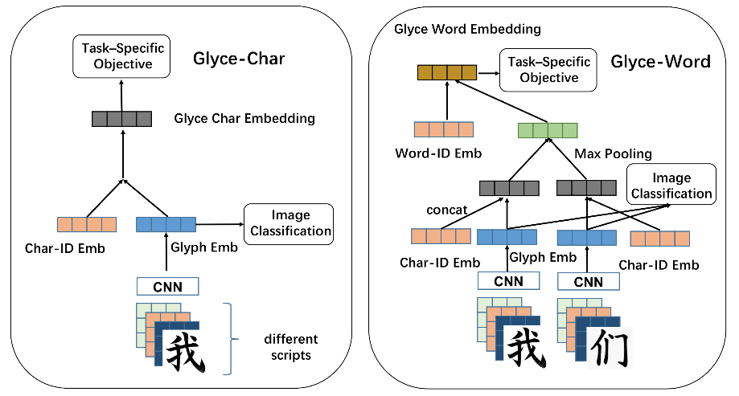

### Glyce: Glyph-vectors for Chinese Character Representations

论文地址: [https://arxiv.org/abs/1901.10125](https://arxiv.org/abs/1901.10125)

##### 要点

最近火爆的 Glyce, the glyph-vectors for Chinese character represetations(怎么缩写的?), 刷新了 13 项中文 NLP 记录. Glyph 是字形的意思, 所以本文就是基于字形信息来学习 character embedding.

小学语文告诉我们, 一个复杂的字, 可能会有"声旁"(表音)或"形旁"(表意). 其实已经有许多中文 word embeddings 算法利用了 sub-character 信息, 有些仅仅利用了部首, 有些用了所有的部(比如"补"的各部是"衣"和"卜"), 更有甚者用类似永字八法的拆字法将汉字拆成笔画的序列(比如蚂蚁金服的cw2vec). 与以上方法不同, **本文是从汉字的图片来学习 character representation**.

使用 CNN 从字形中学习表示的 idea 由来已久, 只是旧方法存在以下一些问题, 使得结果一直不尽如人意:

1. 没有使用正确的汉字版本(就简体/繁体等而言). 汉字的演变过程从易画慢慢演变到易写, 越来越重意去形. 简体中文易写, 但是也丢失了许多象形信息;
2. 没有恰当地使用 CNN 模型. 一张汉字的图片(文中称为logo)通常很小, 比如只有 12x12, 这使得适用于大尺寸图片的 CNN 模型不再适用;
3. 无监管的学习. 按照本文的说法, 像 imageNet 的分类任务, 数据集有上百万张图片, 但是汉字只有 10000+ 个, 极易过拟合, 从而损害了模型的泛化能力.

针对以上问题, 文章一一给出了解决方案:

1. 使用不同版本的汉字, 包括: 金文, 隶书, 篆文, 魏碑, 繁体中文, 简体中文. 此外, 还使用了不同的字体, 包括: 草书, 仿宋. 不同版本不同字体的汉字形成互补 (因为用的 CNN, 可以说是 8 channels 的输入);
2. 用 Tianzige-CNN, 结构如下图所示, 是专门设计用来处理汉字的图片的, 最后一层比较特殊, 使用了 group convolution;
3. 将汉字图片分类作为辅助目标(Auxiliary Objective)加入到目标函数中. 特别注意的是, 此处文章用了一个随时间衰退的参数来权衡任务目标与辅助目标. 训练开始时, 汉字图片分类的占比大, 能提供更多的正则化效果, 而随着参数值的衰退, 任务目标的比重逐渐升高.

从第 3 点, 我们可以知道 glyce 并不像一些 word/character embedding 的用例是固定不变的, 单纯地使用 glyce 时, 它像一个没有使用 pre-trained word/character embedding 的 embeedding layer, 只是 embedding layer 被替换成了以上的更复杂的 Tianzige-CNN.

除了使用 glyce 代替 character embedding, 文章还提出了联合使用 glyce embedding 和 character embedding 的方法, 称为 glyce-char embedding. 在此基础上, 还可以联合使用 glyce-char embedding 和 word embedding, 得到 glyce-word embedding. 组合的方法可以很灵活, 以下是示意图. 鉴于中文的词语可以包含任意多的汉字, 文章在所有 glyce-char embeddings 之上使用了一个 max-pooling.

##### 备注

本文共进行了 13 项实验, 几乎全部证明了 glyce 的优越性能. 但是实验的描述真是一言难尽, 全是一个模子刻出来的: 交代任务, 交代测试集, 交代 SOTA 模型, 如有必要根据任务使用 glyce 替代 character embedding 或使用 glyce-char 或 glyce-word, 交代实验结果, 交代 glyce 的好. 除非想了解中文 NLP 有哪些可用的测试集以及对应的 SOTA 模型, 不建议把实验从头到尾看一遍.
