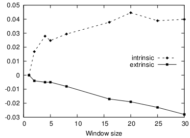

# Intrinsic Evaluation of Word Vectors Fails to Predict Extrinsic Performance

论文地址: [https://www.aclweb.org/anthology/W/W16/W16-2501.pdf](https://www.aclweb.org/anthology/W/W16/W16-2501.pdf)

## 要点

本文的题目高度概括文章的中心思想: 在 intrinsic evaluation \(可以简单地看作 word-level 的测试\)表现良好的 word embeddings, 在 extrinsic evaluation \(可以简单地看作 downstream tasks\) 中的表现可能反而差了. 颇有一种"小时了了, 大未必佳"的悲凉.

文章的实验过程很简明: 使用不同的 window size 来训练 word embeddings, 分别进行 intrinsic 和 extrinsic evaluation, 然后观察 window size 的变化对两者的影响.

结果发现: 随着 window size 的增大, 除了 SimLex-999, 其他的 intrinsic evaluation 的结果趋向于变得更好, 而 extrinsic evaluation 的结果无一例外都变得更差, 总体趋势如下图所示\(性能相对于 window\_size=1 时的变化\). 所以如果仅进行了 intrinsic evaluaton, 发现结果很好, 就说方法很好, 就有点 naive 了. **要全面地反应 word embeddings 的优劣, intrinsic 和 extrinsic evaluation 都是必要的.**

前面单独拎出了 SimLex-999, 随着 window size 的变化, 它的测试结果的变化趋势同 extrinsic evaluation 一致, 可以说 word embeddings 在该测试集上的好坏一定程度上能反应它们在 downstream tasks 的表现. 至于为什么会这样, 和前几天提到的 similarity 和 relatedness 有关. 其他的测试集混淆了这两个概念, 即相似的物品得了高分\(人工标注\), 相关但不相似的\(咖啡和杯子\)也得了高分, 而 SimLex-999 在众包标注任务时就明确规定了只有相似的物品才能打高分, 所以本文所用的测试集只有它真实的反应了 word similarity. 当 window size 小的时候, 会强调单词的功能性, 比如"泡咖啡", 在 window size 为 1 的极端情况下, 一个单词的 global context 会变得很小, 相当于一个很强的噪声过滤, 会使得"咖啡"和"茶"的相似度更高; 而 window size 设置得很大的时候, topic 或者说 domain 的关系就体现出来了, 比如"用咖啡机泡咖啡", "咖啡机"与"咖啡"是相关但不相似的, 但可以说它们属于同一个 topic\(饮料相关的\). 从这一点来看, **进行 word embeddings 的测试时, 还有必要区分"similarity"和"relatedness".**

本文采用的 extrinsic evaluation 是 NER, Chunking 和 POS. 以上结果说明, _对于这些任务, 单词的 function 比 domain/topic 更重要_.

## 备注

当使用无监督的方法进行 sentence-level 的任务时, 比如对于 semantic textual similairity, 使用句中单词的平均向量来表征句子, 这种情况我实在不知道该算 intrinsic evaluation \(例子部分体现了单词的 compositionality\) 还是 extrinsic evaluation \(例子明显属于 downstream task\).

