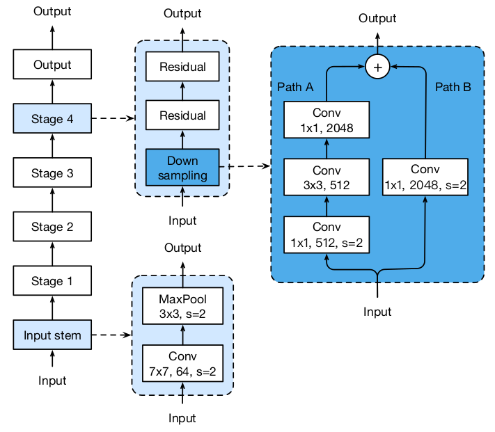
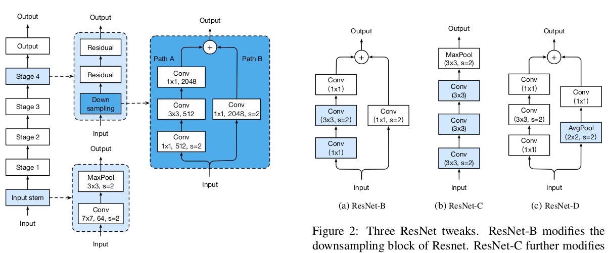
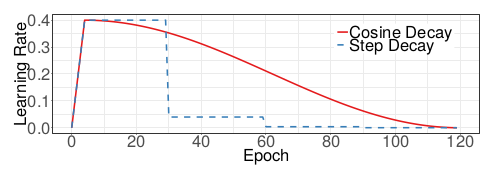

# Bag of Tricks for Image Classification with Convolutional Neural Networks

论文地址: [https://arxiv.org/abs/1812.01187](https://arxiv.org/abs/1812.01187)

## 要点

也许你曾经苦苦搜索过一些神经网络的训练技巧, 看到 "Bag of Tricks ..." 就不要错过了.

文如其名, 本文就梳理了多种技巧, 有训练效率上的, 有模型微调的等等, 许多技巧其实不只限于 Image Classification, 可以直接或者推广到其他领域或者模型. 按行文梳理如下.

文章的 baseline 是 ResNet50, 不使用任何技巧的训练过程就省略了, 模型如下.

### 高效训练篇

要加快训练, 基本上有两种思路: 使用更低的精度表示; 使用更大的 batch size.

#### 更大的 batch size

对于凸问题, 随着 batch size 的增大, 收敛率会降低. 有论文指出, 类似的情况也发生在神经网络上\(非凸\). 也就是说, 训练相同的 epoch, 更大的 batch size 可能会导致性能下降.

增大 batch size 不会改变梯度的期望值, 但会减小方差. 文章首先通过**增大学习率**来换取更快的收敛. 具体来说, 就是$init\_lr+new\_bs/basic\_bs$.

使用太大的学习率的不良后果是, 训练过程不稳定. 为此, 文章的办法是 **learning rate warmup**, 即从一个小学习率开始, 慢慢增大到预设的初始学习率, 训练稳定之时就是到达之时. 还是用了一个简单的公式: $i\_th\_batch\*lr/\#warmup\_batchs$.

这个方法是针对 residual block 的. 在上图的模型中没有体现出来, block 的最后一层可能是一个 BatchNorm layer \($gamma_input+beta$\). 通常按照本文的说法, 它的两个参数 gamma 和 beta 分别初始化为1和0. 但是本文\*将所有 BN 的gamma 都初始化为0_, 于是 residual block 相当于直接输出了输入, 起到类似减少神经网络层数的作用, 有助于初始训练.

No bias decay. 根据另一篇文章的推荐, 本文仅对卷积层和全连接层的 weights 应用了 regularization. bias, 甚至上述的 gamma 和 beta 都不进行 regularization.

#### 低精度训练

32 位浮点数是单精度, 64 位是双精度, 16 位有些地方会说 half. 默认情况下, 浮点数都表示成 32-bit 的. 但是现在的硬件开始携带支持低精度的算数逻辑单元, 比如 V100. 文章的实验发现, FP16 \(16bit float precison\) 的训练能比 FP32 快 2-3 倍.

具体的做法是, 参数有 2 份拷贝, FP32 和 FP16, 训练时用 FP16, 直至计算完梯度, 参数的更新则更新在 FP32, 下一次迭代时, 再拷贝一份 FP16. \(如果是支持这种操作的框架, 应该就是一行代码的事情\).

这句话我不太理解: multiplying a scalar to the loss to better align the range of the gradient into FP16 is also a practical solution.

综合以上所有的技巧, 以 ResNet50 为 baseline, ImageNet 上 Top1 的准确率能提高 0.5%.

### Model Tweaks

本节介绍了模型结构微调的技巧. 正常的 ResNet50 的示意图如下图左所示.

第一个技巧是, 将 residual block 的 path A 上第一个 1x1 卷积的 stride 转移到了 3x3 卷积上, 于是得到了 ResNet-B. 理由是, 一开始就使用 stride 2 丢失了 3/4 的特征, 而将 stirde 2 转移到 3x3 卷积上之后, 不存在特征丢失, 而且输出的 size 也不变.

第二个技巧学习自 Inception-2 模型, 是针对输入模块的 \(上图中的 input-stem\). 基于卷积的计算量与 kernel 的宽高成平方关系, 一个 7x7 的卷积的计算代价 3x3 的 5.7 倍. 于是将最开始的 7x7 的卷积替换为了 3 个 3x3 的卷积, 得到 ResNet-C.

第三个技巧是理由同第一个技巧, 即 stride 为 2 的 1x1 的卷积会丢失 3/4 的特征, 于是将 residual block 的 path B 上 1x1 卷积的 stride 改为 1, 并在前面增加了一个 stride 为 2 的 2x2 的 Average Pooling, 得到上图的 ResNet-D.

实验结果表明, 第一个技巧能提高验证集上的准确率 0.5%, 第二个技巧 0.2% \(在ResNet-B 的基础上, 下同\), 第三个技巧 0.3%.

### Training Refinements

这一节讲的是训练时改进的一些技巧.

#### Cosine Learning Rate Decay

第一次看到 ResNet 对学习率的调整的时候, 我 mark 了一下, 给我挺惊艳的感觉, 大概是训练误差停滞之后, 学习率降为原来的 10%, 重复几次. 本文采取了另一种思路, 即 cosine annealing, 就是让学习率成 cosine 曲线的姿势下降, 如下所示. 学习率先增大是因为上面提到的 warmup. Cosine annealing 的优点比较直观, 开始和结束时, 学习率的衰减都比较慢, 一个可以凭较大的学习率尽情地探索; 最后又可以凭较小的学习率在某个局部空间深耕.

#### Label Smoothing

最早接触到这个技巧大概是在 GAN 上, 因为它的训练太难了, label smoothing 将 1 变成一个略小于 1 的值, 将 0 变化成略大于 0 的值, 从而让梯度更有利于模型的训练. 我觉得 GAN 的例子比较好理解, 让假的看起来不那么假, 让真的看起来不那么真, 相当于让"警察"变得不那么专业, 于是造假就能造起来了.

本文给了一个更数学化的描述, 也不再局限于二分类问题, label smoothing 的公式描述如下. 对于 1 的处理不变, 但是减掉的概率均摊给了其他 K-1 个类头上.

#### Knowledge Distillation

Knowledge distillation 的论文之前做过笔记, 简单讲一些就是, 训练一个更大或者更多模型的, 用它或它们来指导新的小个子模型的训练. 本文是用一个训练好的 ResNet152 来指导 ResNet50 的训练, 采取的方式在 Hinton 那篇中也提到过, 将 ResNet152 的输出作为 soft targets, 但是并没有抛弃原来的 tagret \(如果用了 label smoothing, 就不能称为 hard target 了, 也是软的\). 组合后的 loss 如下. T 还是那篇文章中的温度.

#### Mixup Training

这个技巧, 说实话, 我是惊叹的. 说白了就是采 2 个样本, 将它们混合起来, 包括输入和target, 这就得到了新的样本. 这就像有一种图片, 一个角度看是一个人物, 转一个角度就是另一个人物, 不知道是否真的受启发于此.

实验结果当然表明这些技巧都是好滴, 而且不只是 IamgeNet 上的准确率上来了, 而且模型的泛化能力也进步了 \(就迁移到目标检测和语义分割任务而言\).

