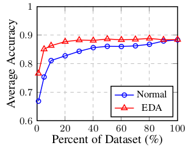
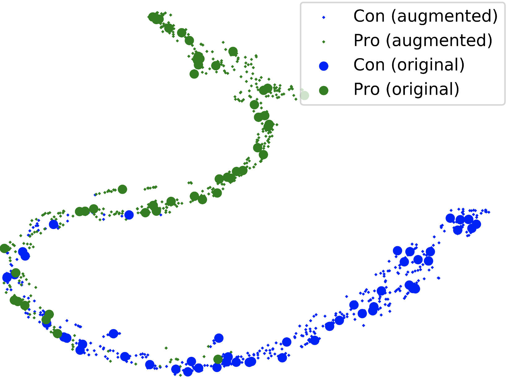

### EDA: Easy Data Augmentation Techniques for Boosting Performance on Text Classification Tasks

论文地址: [https://arxiv.org/abs/1901.11196](https://arxiv.org/abs/1901.11196)

##### 要点

文章提出并验证了几种 text augmentation 技巧, 分别是:

1. 同义词替换 (Synonym Replacement): 从文本中随机选择 n 个(非停词, 下同)单词, 随机替换为对应单词的同义词;
2. 随机插入 (Random Insertion): 与上类似, 不过不是替换, 而是将同义词随机插入句子中;
3. 随机交换 (Random Swap): 随机交换文本中的两个单词, 重复 n 次;
4. 随机删除 (Random Deletion): 以概率 p 删除句子中的单词 (这里肯定需要一个机制保证不会删除所有的单词而留下一个空串).

总的来看, 都属于比较直观的想法, 看起来没有特别出彩的地方, 但是就是没人系统地这样做过实验对比呀. 同义词替换其实在不少之前的论文/方法中都使用到了.

由于文本有长短, 文章根据文本的长度来设置上述的 n: `n=al`, 式中 l 就是文本的长度, a 设置的超参数.

从实验结果来看, EDA 在数据量小的时候对于性能提升特别明显, 如下(使用 EDA 在数据量为原集的 50% 时已经超过了不使用 EDA 在 100% 数据上的结果). 这个结果也不算出人意料, 因为在小数据集上本身就容易过拟合, EDA 可以说增大了数据集, 也可以说引入了噪声, 总之就是起到了防止过拟合的作用. 文章的另一个解释挺有意思的, EDA 会对 vocab 产生影响, 也许就包含了训练集中没有但测试集中有的单词, 这算 data leakage 吗?

文章还就 EDA 对预测标签的影响进行了观察, t-SNE 的结果如下:

还是挺分明的, 说明可以 EDA 不会明显改变句意, 可用. 当然这是在 a 不太大的情况下. 同样很直观的, 不管上述的哪个技巧, 将文本改得面目全非, 标签就变得没意义了.

以下记录文中列举的其他 text augmentation 方法, 文章没介绍的, 就见名如见方法吧:

* Back-translation (大概是用了机器翻译);
* Noising;
* 类同义词替换, 不过用的是词向量的最近邻单词;
* 使用 VAE 和 attribute discriminator (?) 来生成假数据;
* 使用 BiLSTM 从文本上下文中预测得到的词替换代词;

和以上一些方法比起来, EDA 不需要比如 VAE, BiLSTM 等模型, 简单得多, 可以优先考虑.

#### 备注

我在想, 进行 data augmentation 的时候, 根据程度来 smooth label 是不是更好, 也许是我孤陋寡闻了.
