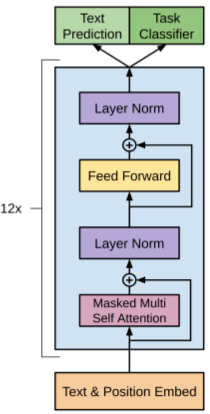

# Language Models are Unsupervised Multitask Learners

论文地址: [https://d4mucfpksywv.cloudfront.net/better-language-models/language-models.pdf](https://d4mucfpksywv.cloudfront.net/better-language-models/language-models.pdf)

## 要点

对于当前 AI 的成功, 基本的共识是三要素的到位: **算法/模型, 数据和算力**. 我最近看了"Architects of Intelligence"一书中对吴恩达的采访, 他强调了, 看得到的成功其实都要归功于监督学习\(_All of the economic value driven by this recent rise of AI is down to supervised learning_\). 本文属于无监督学习的一个成功典范, 它的成功则完全归功于对以上三要素的充分发掘: OpenAI提供无压力的算力支持, Bigger than bigger的模型, 大而多样的文本数据.

近来, 多任务学习和迁移学习很火, 一个始作俑原因是: 在单一任务上训练得到的模型几乎不能直接泛化到其他任务\(作者们怀疑, 在单一领域的数据集上进行单一任务的训练限制了模型的泛化\). 如题目所示, 本文证明了**一个训练良好的 LM, 即使不 fine-tuning\(需要监督\), 天然就能处理多任务.**

不同于一些以单一语料进行训练的模型, 文章想要一个既大且多样的语料. 语料多样的好处在于, 能够提供不同的上下文, 不同的领域知识, 从而赋予 LM 多任务处理\(多面\)的能力, 打个比方: 让只看新闻的人写儿童故事就太勉强人了. 语料的收集在此滤过, 经各种过滤处理后, 共800万个文档, 总计40GB\(不包含 Wikipedia, 因为它是很多数据集的源, 英文的 Wikipedia 的压缩包有28GB\).

对于 LM 的输入, 文章没有提及使用预训练的词向量, 事实上, 应该就没用, 因为语料是全新的. 用了 Byte Pair Encoding\(BPE\), 出自"Neural machine translation of rare words with subword units"的小技巧, 从论文题目可以看出它是为低频单词的表示而生的, 本文的用途也是如此.

之后就是一个 Transformer 模型, 现在最得意的模型, 没有之一. 更准确点, 是 OpenAI GPT 模型的改良版. 源模型的介绍请出门左转看[这里](https://github.com/iamkissg/papernotes/blob/master/2018/6/Improving_Language_Understanding_by_Generative_Pre-Training.md), 示意图如下. 本文对模型的改良, 按照本文的说法是: Layer Normalizatoin 移到了每个sub-block的输入之前; 在最后一个 self-attention block 之后增加了一个 LN; 残差层的权重初始化是乘以了一个 1/sqrt\(残差层数\); 上下文的大小从 512 扩展到了 1024 个单词\(超长依赖, 注意这是 LM, 而不是 Word Embedding\).

实验部分, 你可能看到过媒体大肆鼓吹的"打破7/8项记录". 是真的, 而且是没有 fine-tuing 的真·零样本设置. 没错, 但是来了, 这些任务都是 language modeling 的任务. 君不见本文使用的语料有多大, 尽管文章最后分析了训练集与测试集的语料重叠度很小, memorization 的现象存在但很微弱, 但是毕竟还是同类型的任务, 而且是本身就可以无监督学习的 language modelding 不是文本之类的任务, 语料的影响不容忽视. Pre-SOTA 的结果是从其他论文中直接拷贝的, 严格地说, 是模型和数据两方面的原因带来的突破, 由于缺少baselines在本文提出的 WebText 上训练的结果, 无从得知模型和数据哪个的影响更大.

实验的后半部分, 本文还进行了非 language modeling 的任务探索\(以下就最好的 GPT-2 模型而言\):

* CoQA, 没有使用训练集, 就是 greedy decoding, 55F1\(我没概念, 作为对比 BERT 是 89F1\);
* 摘要任务, 使用 TL;DR 提示词的情况下, 勉强比随机从原文呢挑选3个句子好一些, 不用提示词就更差得多了;
* 英译法, 很差\(5 BLEU\), 主要原因是用得英文语料, 就没多少法语单词;
* 法译英, 11.5 BLEU, 比一些无监督机器翻译要好, 但最好的无监督翻译可达到 33.5 BLEU;
* 2019 年某篇论文提出的 QA 数据集上, 准确率 4.1%.

从以上结果, 大概可以说, 当应用于非 language modeling 任务时, 在完全无 fine-tuning 的情况下, LM 模型的泛化很困难, 几乎完全垮掉. 不过想想也就释然了, 在不知道任务是什么的情况下, 还能出色地完成, 这是有违天道的.

值得一提的是, 由于语料足够大, 即使是本文使用的最小的模型, 也还处于欠拟合的状态. 网上风传的由 GPT-2 生成的新闻之类, 在附录也能看到大量此类内容, 都证明了 GPT-2 超强的语言建模能力.

