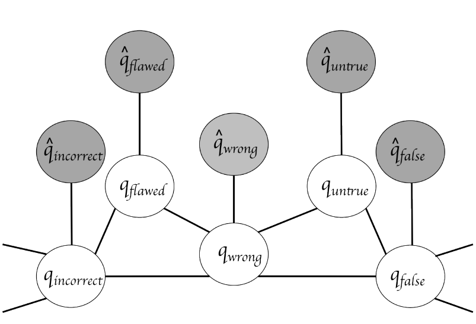

# Retrofitting Word Vectors to Semantic Lexicons

论文地址: [http://aclweb.org/anthology/N15-1184](http://aclweb.org/anthology/N15-1184)

## 要点

在我的印象中, 本文是较早对 word vectors 进行 post-process 改进的. 文章使用了提供不同类别语义\(同义, 上下义, 释义\)信息的语义词典\(semantic lexicon\), 强化了单词与语义相关词的关系.

具体而言, 本文就是通过语义词典中单词间的关系构造了一张无向图, 然后为每个单词再创建一个节点, 用以表征预先学好的词向量, 再用一条边将同一个单词的两个节点相连, 如下图所示\(白色节点根据语义词典构造得, 灰色节点是虚拟节点\).

忽略词向量间的关系\(灰色节点间无边相连\), 上图中的灰色节点表征了单词的语义, 而白色节点间的边表征了单词间的关系. 本文要做的就是在两者间取得一个平衡. 目标函数如下所示.

## 要点

文章共使用了 PPDB, WordNet, FrameNet 作为语义词典, 除了 WordNet 又区分出一个同义词子集, 文章并没有严格区分不同的语义, 比如同义词与上下义词的不同, 在这一点上如果愿意再花一点功夫, 也许能得到更好的结果. 而事实是, retrofitting 可能会有帮助, 也可能不, 取决于使用的词典, 甚至在 similarity/relatedness 以外的任务上可能全军覆没.

