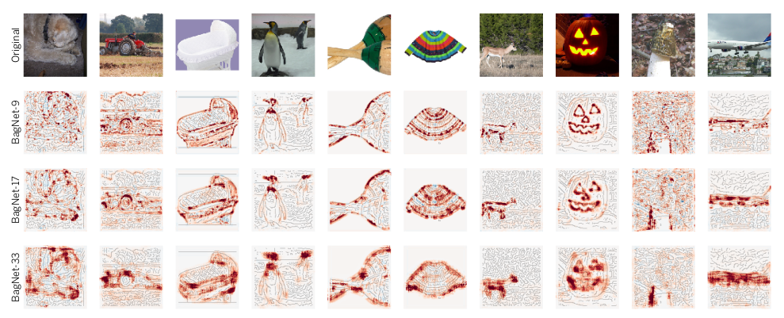

### Approximating CNNs with Bag-of-local-Features models works surprisingly well on ImageNet

论文地址: [https://openreview.net/forum?id=SkfMWhAqYQ](https://openreview.net/forum?id=SkfMWhAqYQ)

##### 要点

我记得这篇论文问世的时候, 有句话让我印象太深刻了: 凡是过往, 皆为调参?

本文受启发于 Bag-of-Features 模型, 这类模型的最典型代表应该要数 Bag-of-Words 了. 拿 BoW 作类比的话, BoW 用句子中单词出现的次数来表示该句子, 不考虑单词间的关系, 比如"我/爱/北京/天安门/天安门/前/太阳/升"就可以表示成{我: 1, 爱: 1, 北京:1, 天安门: 2, 前:1, 太阳: 1, 升: 1} (称为一个袋子, 不管什么单词, 都往里面塞). 而本文提出的模型 (BagNets), 就是装满图片局部特征的袋子, 最后根据袋子里装的特征来表示图片, 不考虑特征们的空间关系, 举个例子一只青蛙"一张嘴，两只眼睛四条腿".

BagNets 中的每一个局部特征都能为整张图片发声, 比如, "四条腿"的特征就会说"我不是人, 我不识人", 从而比提供了一定的可解释性. 模型用 ResNet 将每个 qxq 的局部图片表示成 d 维特征 (Continuous Bag-of-Words 是时候登场了), 然后将特征输入一个线性分类器, 来建立特征用图片全貌(类别)的联系 (这个时候, 可以想象成一个 window size 为 1 的 Skip-gram, 其他所有类都是 negative samples). 最后, 综合考虑 (平均) 上一步中所有局部特征的投票(分类)结果, 得出图片的类别.

由于局部特征的"决策"出自线性分类器, 而全局"决策"也只是出于平均法 (每个局部特征对每个类别都分配了一个概率, 平均所有局部特征对一个类别的概率), BagNets 的可解释性比较好 (屏蔽掉 ResNeti 作为特征提取器).

从实验结果来看, BagNets 速度上明显不如将原始的 ResNet. 这是显而易见的, 原来一张图片一个表示, 现在每个局部都有一个表示, 计算量就不能相提并论了.

实验结果还表明, 物体的形状对于决策最有帮助, 而背景基本就直接被忽视掉了, 如下图所示. 不要被 heatmap 所迷惑了, 每一个局部特征有一个所有类别的概率表, 一个局部特征分配给正确类别的概率越大 (可能不是最大的), 在 heatmap 中的颜色就越深, 这才勾勒出了图片的轮廓.

其他的实验结果就留待搞 CV 的同学自己去总结吧.
