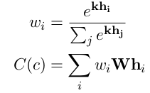
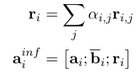

# pair2vec: Compositional Word-Pair Embeddings for Cross-Sentence Inference

论文地址: [https://arxiv.org/abs/1810.08854](https://arxiv.org/abs/1810.08854) 项目地址: [https://github.com/mandarjoshi90/pair2vec](https://github.com/mandarjoshi90/pair2vec)

## 要点

本文的想法挺奇特, 学习两个单词的表示, 即一个向量来表示 \(word\_x, word\_y\) 这样的组合. 方法上也稍有不同, 一般的 word embeddings, 利用的是 target word 和 context 两者间的关系; 本文可以说有两个 target words, 但事实上它们又被认为是一体的, 考虑的是 \(word\_x, word\_y\) 和 context 的关系 \(就不说是三角关系了吧\).

用 R\(x, y\) 作为 \(x, y\) 这个组合的表示. 本文中, 如下公式来计算, 其中粗正体的 x 和 y 是 L2 normalized 后的词向量, 上标 4 表示 4 层 MLP. \(不限于文章的这种表示方法\)

而 context 则用了一个单层 BiLSTM, 最后对 hidden states 用 attention pooling 得到一维的向量:

得到 R\(x, y\) 和 C\(c\) 之后, 就要强化单词对与真上下文之间的联系, 还是用了 negative sampling. 不过使用了两种 negative sampling 的变种:

1. Bivariate Negative Sampling: 只篡改 context 作为负样本;
2. Multivariate Negative Sampling: 可同时篡改 x, y, 或 c, 任何一方被修改了都被认为是负样本.

文中用到了一项名为_Typed Sampling_的技术. 采样 x 或 y 的负样本时, 除了从一开始就生成的覆盖整个 Vocab 的unigram distribution 的中采样, 还从对应单词的 top 100 个近邻 \(用 cosine similarity 度量距离\) 采样. 这和 Airbnb 的基于同一 market 的采样思路相同, 能强化特定类别单词间的关系.

本文剩下的工作讨论了如何将习得的 pair2vec, 即 R\(x, y\) 作为特征加入模型中. 为了不破坏 encoder 中的 word embeddings, 文章将 pair2vec 加到了 encoder 之上的层中.

从第一个公式可以看出, R\(x, y\) 和 R\(y, x\) 是不对称的. 文章就用如下公式为两个序列中所有的单词对生成了关系表示 \(\[;\] 表示 concatenation\):

简洁起见, 省略 encoder 的计算过程, 将以上单词对的关系加入模型可以用如下公式描述 \(alpha\_{i,j} 是单词 a\_i 和 b\_j 计算得到的注意力系数\):

上述公式针对不同的模型会有所改变, 不变的是, 都是以 concate 的方式将 r 注入到模型中.

从实验结果来看, pair2vec 的帮助很显著. 以下是 SQuAD 和 MultiNLI 的结果:

