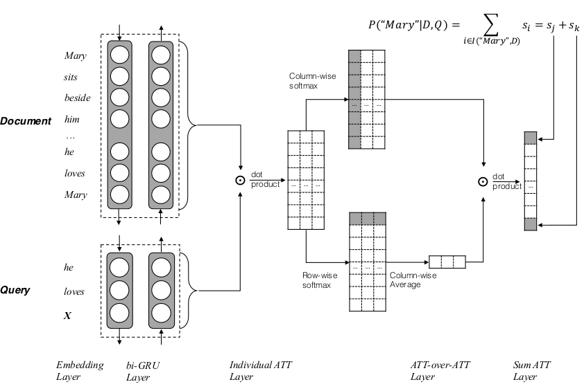

### Attention-over-Attention Neural Networks for Reading Comprehension

论文地址: [https://arxiv.org/abs/1607.04423](https://arxiv.org/abs/1607.04423)

##### TL;DR

本文在机器阅读的常用的 document-level attention 之外, 又引入了一层 attention, 考量 attention 的重要性. 在候选答案时, 提出了 N-best Re-Ranking 策略, 对 N 个最优的候选项进行 double-check, 从中选择最后答案.

##### Key Points

* 机器阅读的模型关注了 document 的表示 (对 document 中的词进行 attention learning), 但很少关注到 query 的表示. 本文在 document-level attention 之上引入了另一个 attention, 来表示每个 attention 的重要性, 即题目所谓的 attention-ovoer-attention.
* 不同于一些将 query 表示成一个向量的模型, 文中保留了 document 和 query 中每个单词的表示 (contextual embedding).
* 计算 query 中单词对 document 中单词的依赖程度: $M(i, j)=h_{doc}(i)^T\cdot h_{query}(j)$, 得到的 $M\in \mathbb{R}^{|D|*|Q|}$ (|D| 表示 document 的长度, 即单词数, |Q| 表示 query 的长度). 然后对矩阵按列进行 softmax, 这样每一列表示 query 中一个单词与整个 document 中所有单词的匹配程度, 称为 query-to-document attention $\alpha$.
* 所谓 attention-over-attention, 就是反过来, 计算 document-to-query attention. 由于 cosine similariy 是对称的, 之前得到的 M 可以直接用,只是按行进行 softmax, 就得到了 document 中单词对整个 query 的 attention, 称为 document-to-query attention $beta$.
* 为计算 attention-over-attention, 文中先对 $\beta$ 按列求均值: $\beta=\frac{1}{n}\Sigma_{t=1}^{|D|}beta(t)$, 然后计算 $\alpha$ 和 $\beta$ 的点积: $s=\alpha^T \beta$. 这样, query 中每个单词的贡献/重要性都得到了考虑.
* 预测时, 文章采用了 ASReader 的方法, 将 unique word 的所有作为 answer 的概率相加, 最高者为 answer.
* 文中提出了 N-best Re-ranking 策略, 即生成 N 个最可能的候选答案, 代回 query 中, double-check 答案的正确性.
* 此处文章使用了 3 种 Language Modeling 模型来评估答案, 分别是 Global N-gram LM, Word-class LM, Local N-gram LM. 前两者能捕获全局信息, 在训练集上训练得到, 后者则用于捕获局部信息, 在对应的 document 上训练.
* 使用 K-best MIRA 算法学习三个 LM 的权值, 然后加权求和从 N-best 答案中选出最终答案.
* 实验发现, Local N-gram LM 和另两个 LM 更有适合的场合. 对于 common noun 类型的答案, global features 帮助更大; 对于实体名作为答案的情况, local LM 可以提供更多有帮助的信息.

##### Notes/Questions

* 文章通过更过地利用 document 与 query 的交互信息来提升模型性能, 关于为什么要先求均值, 然后求点积, 一笔带过. 虽然结果很好, 个人感觉没有解释清楚.
* 居然采用 ASReader 的方法, 虽然那篇论文写得真的不匝地, 但方法简单也挺有效. 本文在 ASReader 的基础上并没有引入太多的复杂性.
* N-best Re-Ranking 有点类似 LM 使用的 Beam Search, 摒弃了贪婪方法, 提升结果的可靠性.
