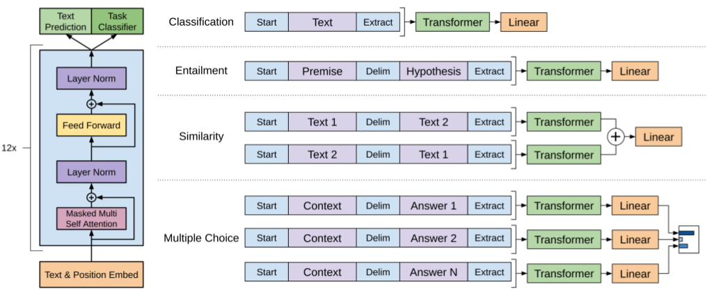

### Improving Language Understanding by Generative Pre-Training

论文地址: [https://s3-us-west-2.amazonaws.com/openai-assets/research-covers/language-unsupervised/language_understanding_paper.pdf](https://s3-us-west-2.amazonaws.com/openai-assets/research-covers/language-unsupervised/language_understanding_paper.pdf)

##### TL;DR

本文通过在不同类型大语料上进行无监督预训练, 习得丰富的语言特征, 再迁移到指定任务上, 继续 fine-tuning, 实现在特定任务上的性能提升. 目标和ELMo 类似, 只是方法上略有不同. 如何无缝地对接起两个阶段是本文的看点.

##### Key Points

* 同 ELMo 系列的出发点相同, 现在业界已经认识到仅仅从大型语料中学习单词级特征并迁移还远远不够. 但更高级的特征学习有两大挑战:
    1. 如何有效地学习可迁移的文本特征尚未明确;
    2. 如何有效地将习得的特征迁移到目标任务上尚未达成共识.
* 本文提出的方法和 ELMo 系列那两篇类似, 都是将训练分为两部分: *无监督预训练*和有*监督调参*. 同 word embedding 的迁移一样, 前者基本用于确定参数的初始值, 后者的调参则能带来更多的性能提升.
* 文中提到的一点, 值得记一下: 预训练的作用和 regularization 类似, 使得深度模型能更好地泛化.
* 本文的一个目标是最小化两个学习阶段的改动, 争取无缝迁移. 通过两个阶段设置不同的目标函数来实现这一点: 预训练阶段, 学习 lanaguga modeling; 调参阶段则根据具体任务设置不同的目标.
* 本文使用 transformer decoder 来学习文本表示, 利用了 attention 能捕捉更长期的依赖的特点, 来学习更长期的语言结构.
* 预训练阶段, 就是学习 language model, 和一般方法不同的是, 文中设置了一个 context window, 不考虑过远的单词/依赖. 另一点值得主意的是, 在这一阶段, 文章使用了两类互补的语料: 一类包含连续的长文本, 用于学习长距离特征; 另一类语料则由句子组成, 即一条数据的长度不会太长, 从而学习不同的特征.
* Fine-tuning 阶段, 根据本文的初衷, 不做过多改动, 将目标函数替换为特定任务的目标. 从参数的变化上讲, 只是增加了最后一层的参数以及几个 token vectors. (ELMo 则是在 biLM 之上增加了神经网络, 实现对特定任务的适应)
* 举例说明, 如何将预训练的模型适应到特定任务:
    * 文本分类: 这是最简单的, 在 transformer decoder 之上增加一个 sigmoid/softmax 输出层即可.
    * textual entailment: 此时将前提 premise 和假设 hypothesis 用一个分隔符连接起来 (顺序不可交替) 作为模型输入, 后面的操作同文本分类;
    * 文本相似性任务: 同样用分隔符将两个句子拼接起来, 两种拼接的结果都作为模型输入, 得到两个序列表示, 做一个计算, 然后输入输出层;
    * QA: 此任务用分隔符将 context, question, answer 都拼接起来作为模型输入, 有多少个候选答案, 就学习多少个序列表示, 最后将相当于得到了答案的分布.

* 本文使用 transformer decoder 来学习文本表示, 训练过程和模型参数的设置沿用了前两篇 transformer 论文中的设置.
* 实验发现:
    * transformer decoder 的层数越多, 在特定任务上的性能就越好, 可以说特征迁移得越成功, 作者将之归因为预训练模型的每一层都包含了解决目标任务的有用 functionality;
    * fine-tuning 阶段, 同时使用一个辅助目标函数, 文中依然为 language modeling objective, 能获得更好的泛化性能, 还能加速收敛. 这对于大数据集比小数据集的增益更显著;
    * transformer decoder 比 LSTM 更好, 在文章采用的 12 个测试任务上, 平局有 5.6% 的提升;
    * 预训练的过程则平均带来了 14.8% 的提升, 证明了预训练的有效性.

##### Notes/Questions

* 除 word embedding 之外的模型训练/特征迁移, 俨然成了一个研究的趋势. 同 word embedding 一样, 可以作为下游任务的基础. 这是一个非常值得关注的研究领域.
