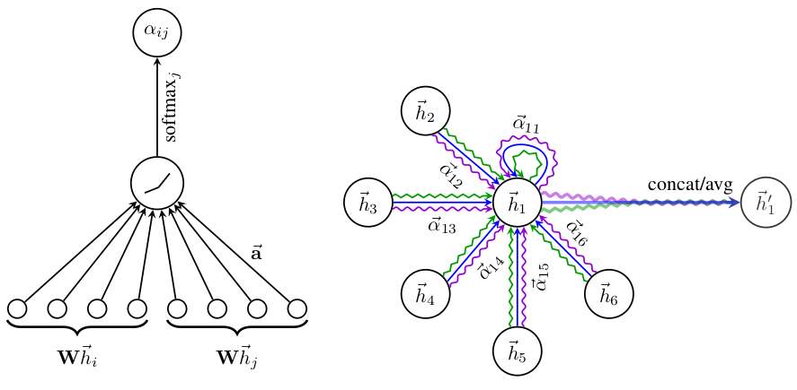

### [Graph Attention Networks](https://arxiv.org/abs/1710.10903)

#### TL;DR

本文提出了基于 Attention 的, 用于图结构数据中顶点分类的模型 GAT. 文中构造了一个 graph attentional layer, 并全程使用该结构. 实际上, graph attention layer 就是一个 masked self-attention layer, 仅计算一个顶点与其邻点的依赖程度, mask out 图中其他点.

#### Key Points

* 文中提到了两种结构的数据: grid-like structure data 和 graph-structure data. 前者是我们通常用于训练的图片, 时序数据 (可看作一维网格) 的统称; 后者则指代那些无法用网格形式表示, 但能以图形式表示的数据, 比如社交网络, 生物网络等. 文章提出的模型正是为了解决后者的表示学习.
* 之前用于学习图结构数据的方法主要分两类 (读者权当了解好了):
    1. spectral approach. 习得的 filters 依赖于 Laplacian eigenbasis, 而后者又依赖于图结构. 这使得模型的可迁移性很差, 在特定结构上训练好的模型不能直接应用于不同结构的图;
    2. non-spetral approach. 这类方法直接在图上定义了卷积运算, 对空间上邻近的点进行卷积. 这类方法的问题在于顶点的邻点数不同, 如何保持 CNN 的参数共享是一个挑战.
* 本文提出了一种基于 attention 的模型 GAT, 其思想是通过 self-attention 的方法, 利用邻点来学习顶点的表示.
* 由于 attention 可以看作对所有邻点的加权平均, 因此适用于任意邻点数的情况, 避免了 non-spectral approach 的问题.
* 模型具有很好的泛化能力, 可应用于训练过程中未见过的图.
* GAT 由单一的结构叠加得到, 文中称为 graph attentional layer.  该层的输入是一组顶点的特征 $\mathbf{h}={ \vec{h_1}, \vec{h_2}, ..., \vec{h_N} }$, 期间通过 self-attention 计算各特征之间的依赖程度, 最终得到新的顶点特征, 作为输出 $\mathbf{h}^{'}={\vec{h_1}^{'}, \vec{h_2}^{'}, ..., \vec{h_N}^{'}}$.
* 为获得对输入特征的有效转换, 对顶点特征先进行线性变换, 再计算它们的依赖程度: $e_{ij}=a(\mathbf{W}\vec{h_i},\mathbf{W}\vec{h_j})$.
* $a(\cdot, \cdot)$ 由一个全连阶层和 LeakyReLU 组成: $a(\mathbf{W}\vec{h_i},\mathbf{W}\vec{h_j})=LeakyReLU(\vec{a}^T [\mathbf{W}\vec{h_i}||\mathbf{W}\vec{h_j} ])$ ($||$ 表示 concatenation).
* 通过 masked attention 将图的结构信息注入模型中, 具体地: $\alpha_{ij}=softmax_j(e_{ij})=\frac{exp(e_{ij})}{\Sigma_{k\in N_i} exp(e_{ik})}$ (此处 $N_i$ 表示顶点 i 的邻点的集合, 包括自身).
* 最后 $\vec{h_i^{'}}=\sigma(\Sigma_{j\in N_i}\alpha_{ij}\mathbf{W}\vec{h_j})$,
* 文章发现使用 multi-head attention 有助于稳定学习过程, 并在中间层与输出层使用了不同的聚合策略:
    * 中间层使用 concatenation 来拼接 multi-head 的结果: $\vec{h_i^'}={||}_{k=1}^K \sigma(\Sigma_{j\in N_i}\alpha_{ij}\mathbf{W}\vec{h_j})$
    * 输出层使用对 multi-head 的结果求平均: $\vec{h_i^{'}}=\sigma(\frac{1}{K} \Sigma_{k=1}^K \Sigma_{j\in N_i}\alpha_{ij}\mathbf{W}\vec{h_j})$
* Attention 能够在图的所有边上共享, 而不必知道图的全局结构 (之前的一些方法依赖于此). 这一方面带来了更好的泛化能力, 另一方面, 能通用于有向图与无向图.
* 训练时, 在数据集较小的情况下, 使用 L2 regularization 和 Dropout; 在数据集足够大的情况下, 不使用 L2 regularization 和 Dropout.

#### Notes/Questions

* 在 Transformer 姊妹篇中, 使用了图的结构, 学习边的表示来编码相对位置信息.
* 本文中提到将 attention 用于 graph, 并不要求是无向图. 实情时, attention 学不到位置信息, 文中利用的是邻接关系. 常规做法, attention on graph 学到的都是非对称的 attention, 虽然两个顶点互为顶点, 但它们各自的邻接情况不同, 使得依赖是非对称的.
* 文中使用的方法很类似 Google 的 PageRank 算法: 以图来表示网址, 一个网址的重要性取决于链接到它的网址的数量以及它们的重要性.
* GAT 具有良好泛化能力的一个重要原因是, 它重局部而轻全局. 在现实生活中, 雁阵/鱼群中的各体只会关注附近同伴的动向, 随它们而动, 但整体涌现出一种别样的智能.
